# 概览

> **代码仓库：** [github.com/NVIDIA/TensorRT-Edge-LLM](https://github.com/NVIDIA/TensorRT-Edge-LLM)

> 若使用 NVIDIA DRIVE 平台，请参阅随 DriveOS 发行版提供的文档。

## 什么是 TensorRT Edge-LLM？

TensorRT Edge-LLM 是 NVIDIA 面向嵌入式平台的大型语言模型（LLM）与视觉语言模型（VLM）的高性能 C++ 推理运行时。它支持在 NVIDIA Jetson、NVIDIA DRIVE 等资源受限设备上高效部署前沿语言模型。

## 主要特性

- **高性能**：经优化的 CUDA 内核与 TensorRT 集成，追求最大吞吐
- **省显存**：先进的 KV 缓存管理与量化支持（FP8、INT4）
- **可上线**：纯 C++ 运行时，无 Python 依赖
- **面向边缘**：专为嵌入式与车载场景设计
- **灵活**：支持 LoRA 适配器、推测解码与多模态模型
- **工具齐全**：Python 导出流水线、引擎构建器与运行时一体交付

## 核心组件

> **代码位置：** `tensorrt_edgellm/`（Python）、`cpp/`（C++）、`examples/`（示例）

TensorRT Edge-LLM 采用三阶段流水线：

```mermaid
%%{init: {'theme':'neutral', 'themeVariables': {'primaryColor':'#76B900','primaryTextColor':'#fff','primaryBorderColor':'#5a8f00','lineColor':'#666','edgeLabelBackground':'#ffffff','labelTextColor':'#000','clusterBkg':'#ffffff','clusterBorder':'#999'}}}%%

graph LR
    HF_MODEL[自回归模型<br>*如 HuggingFace*]
    PYTHON_EXPORT(Python 导出流水线)
    ONNX_MODEL[ONNX<br>模型]
    ENGINE_BUILDER(引擎构建器)
    TRT_ENGINE[TensorRT<br>引擎]
    CPP_RUNTIME(C++ 运行时)
    SAMPLES(示例)
    APPLICATIONS(应用)

    HF_MODEL --> PYTHON_EXPORT
    PYTHON_EXPORT --> ONNX_MODEL
    ONNX_MODEL --> ENGINE_BUILDER
    ENGINE_BUILDER --> TRT_ENGINE
    TRT_ENGINE --> CPP_RUNTIME
    CPP_RUNTIME --> SAMPLES
    SAMPLES --> APPLICATIONS

    classDef greyNode fill:#f5f5f5,stroke:#999,stroke-width:1px,color:#333
    classDef nvNode fill:#76B900,stroke:#5a8f00,stroke-width:1px,color:#fff
    classDef darkNode fill:#ffffff,stroke:#999,stroke-width:1px,color:#333
    classDef inputNode fill:#f5f5f5,stroke:#999,stroke-width:1px,color:#333
    classDef itemNode fill:#ffffff,stroke:#999,stroke-width:1px,color:#333

    class HF_MODEL inputNode
    class ONNX_MODEL,TRT_ENGINE itemNode
    class PYTHON_EXPORT,ENGINE_BUILDER,CPP_RUNTIME nvNode
    class APPLICATIONS darkNode
    class SAMPLES nvNode
```

| 组件 | 说明 |
|-----------|-------------|
| **Python 导出流水线** | 基于 Python 的工具链，将 HuggingFace 模型转为 ONNX，并支持量化（FP8、INT4、NVFP4）。[了解更多](03.1_Python_Export_Pipeline.md) |
| **引擎构建器** | 基于 C++ 的应用，将 ONNX 模型编译为经优化的 TensorRT 引擎。[了解更多](03.2_Engine_Builder.md) |
| **C++ 运行时** | 基于 C++ 的运行时，执行 TensorRT 引擎，支持 CUDA Graph、LoRA 与 EAGLE。[了解更多](04.1_C++_Runtime_Overview.md) |
| **示例** | 展示 LLM、多模态与工具类用法的参考实现。[了解更多](05_Examples.md) |

## 适用场景

TensorRT Edge-LLM 适用于：

**车载**
- 车内 AI 助手
- 语音控制界面
- 场景理解与描述
- 驾驶辅助系统

**机器人**
- 自然语言交互
- 任务规划与推理
- 视觉问答
- 人机协作

---

## 支持的平台

### 硬件平台

| 平台 | 软件发行版 | 链接 |
|----------|------------------|------|
| NVIDIA Jetson Thor | JetPack 7.1 | [JetPack 官网](https://developer.nvidia.com/embedded/jetpack) |
| NVIDIA DRIVE Thor | NVIDIA DriveOS 7 | 详情请参阅 NVIDIA DriveOS 7 发行文档 |

> **说明：** 上表平台为官方支持并已测试。TensorRT Edge-LLM 也可能在其他 NVIDIA GPU 平台（例如独立 GPU、其他 Jetson 设备）上运行，但这些平台不在官方支持范围内，仅可用于实验。

### 支持的模型家族

**大型语言模型：**
- Llama 3.x（1B - 8B）
- Qwen 2/2.5/3（0.5B - 7B）
- DeepSeek-R1 Distilled（1.5B、7B）

**视觉语言模型：**
- Qwen2/2.5/3-VL（2B - 8B）
- InternVL3（1B、2B）
- Phi-4-Multimodal（Phi-4-multimodal-instruct，5.6B）

完整列表见 [支持的模型](02_Supported_Models.md)。

---

## 下一步

1. **[快速入门](01.2_Quick_Start_Guide.md)**：约 15 分钟跑通流程
2. **[安装](01.3_Installation.md)**：详细安装说明
3. **[支持的模型](02_Supported_Models.md)**：了解支持的模型
4. **[定制指南](07_Customization_Guide.md)**：按需定制与扩展（附源码）

---

**如有问题或反馈，请访问 [TensorRT Edge-LLM GitHub 仓库](https://github.com/NVIDIA/TensorRT-Edge-LLM)。**

