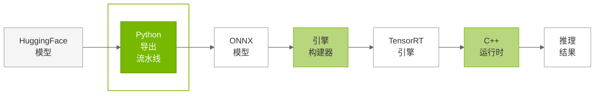
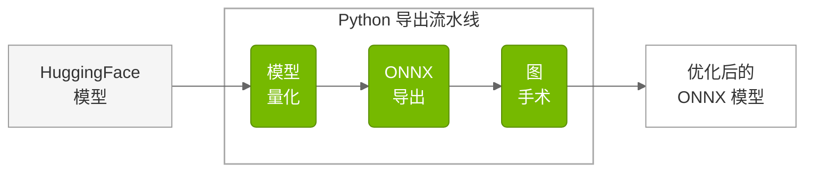
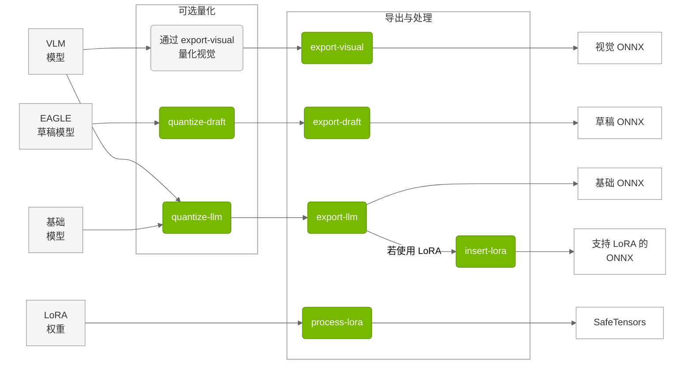

# Python 导出流水线

## 概览

TensorRT Edge-LLM 导出流水线是一套完整的基于 Python 的系统，将 HuggingFace 模型转换为适合 TensorRT 引擎编译的优化 ONNX 表示。流水线负责模型量化、ONNX 导出，以及 LoRA 适配与多模态处理等专项能力。

### 用途

导出流水线在 TensorRT Edge-LLM 工作流中处于**第一阶段**：






### 流水线阶段

1. **模型加载**：加载 HuggingFace 模型与分词器
2. **量化**（可选）：应用降低精度的技术
3. **ONNX 导出**：将 PyTorch 模型转为 ONNX
4. **图手术**：为 TensorRT 优化 ONNX 计算图
5. **配置生成**：生成构建配置文件


## 导出工具

TensorRT Edge-LLM 提供专用命令行工具，支持量化与导出为 ONNX：




> **说明**：视觉语言模型（VLM）需**同时**使用 `export-llm`（语言部分）与 `export-visual`（视觉编码器）才能完成导出。示例见下文 [多模态 VLM 导出](#多模态-vlm-导出)。

### 工具概览

`tensorrt-edgellm` 包提供七个面向不同导出场景的命令行工具：

| 工具 | 输入 | 输出 | 说明 |
|------|--------|---------|-------------|
| **`quantize-llm`** | HuggingFace 模型 | 量化后模型 | 使用 NVIDIA ModelOpt 对 LLM 量化。支持 FP8、INT4 AWQ、NVFP4，用于降显存与优化性能 |
| **`export-llm`** | HuggingFace/量化模型 | ONNX 模型 | 将 LLM 导出为 ONNX。支持标准 LLM 与带精度优化、图手术的 EAGLE 基础模型 |
| **`export-visual`** | VLM 模型 | 视觉 ONNX | 导出多模态模型的视觉编码器。支持 FP8 量化与动态分辨率 |
| **`export-draft`** | 基础 + 草稿模型 | 草稿 ONNX | 导出用于推测解码的 EAGLE 草稿模型。针对 EAGLE3 草稿架构与词表映射 |
| **`quantize-draft`** | 基础 + 草稿模型 | 量化草稿 | 对 EAGLE 草稿模型量化。使用基础模型输入做校准 |
| **`insert-lora`** | ONNX 模型 | 支持 LoRA 的 ONNX | 在现有 ONNX 中插入 LoRA 模式，通过改图支持动态 LoRA |
| **`process-lora`** | LoRA 权重 | SafeTensors | 按 TensorRT Edge-LLM 规范处理 LoRA 适配器权重，供运行时加载 |


---

## 量化方法

导出流水线支持多种量化方式，以适配不同硬件与性能目标：

| 方法 | 说明 | 精度 | 平台要求 | 显存压缩 |
|--------|-------------|-----------|----------------------|------------------|
| **FP16** | 半精度浮点 | 16-bit | 全平台 | 基准 |
| **FP8** | 8-bit 浮点 | 8-bit | **SM89+**（Ada Lovelace 及更新） | 约 2× |
| **INT8 SQ** | 8-bit SmoothQuant | 8-bit | 全平台 | 约 2× |
| **INT4 AWQ** | 4-bit 整数 + AWQ | 4-bit | 全平台 | 约 4× |
| **INT4 GPTQ** | 4-bit GPTQ 权重量化 | 4-bit | 全平台 | 约 4× |
| **NVFP4** | NVIDIA 4-bit 浮点 | 4-bit | **SM100+**（Blackwell 及更新） | 约 4× |

### 量化细节

**FP16（基准）**

- 标准半精度浮点
- 全平台通用
- 精度最好、显存占用最大
- 建议用于精度验证与基线

**FP8（通用）**

- 8-bit 浮点量化
- 显存约减半，精度损失较小
- 需要 **SM89+**（Ada Lovelace 及更新 GPU）
- 使用样本数据自动校准
- **FP8 视觉编码器**：视觉模型支持
- **FP8 LM Head**：语言模型头支持

**INT8 SQ（SmoothQuant）**

- SmoothQuant 8-bit 整数量化
- 全平台支持，主要面向 Ampere
- Blackwell 上建议使用 FP8 或 NVFP4 以获得更好精度与性能

**INT4 AWQ（激活感知权重量化）**

- 4-bit 整数权重量化
- 利用激活统计优化量化
- 显存约压缩为 1/4
- 校准得当可较好保持精度
- 全平台支持

**INT4 GPTQ**

- 4-bit GPTQ 权重量化
- 可直接加载 HuggingFace 上的量化模型
- GPTQ 检查点无需额外量化步骤
- 安装：`BUILD_CUDA_EXT=0 pip install -v gptqmodel --no-build-isolation`
- 全平台支持

**NVFP4（NVIDIA 4-bit 浮点）**

- NVIDIA 专有 4-bit 浮点格式
- 在 **SM100+**（Blackwell 及更新 GPU）上硬件加速
- 显存约压缩为 1/4，性能较优
- Thor 平台推荐
- **NVFP4 LM Head**：语言模型头支持

**说明**：INT4 GPTQ 模型可直接从 HuggingFace Hub 加载，或使用 [GPTQModel](https://github.com/ModelCloud/GPTQModel) 量化。对已是 GPTQ 的检查点，无需再运行 `tensorrt-edgellm-quantize-llm`。

---

## 安全与模型完整性

**⚠️ 用户责任**：在将模型导出为 TensorRT Edge-LLM 格式前，用户须自行验证全部模型产物（基础模型、LoRA 权重、分词器、配置等）的完整性。

### 模型签名与校验

**强烈建议**在推理前使用 [model-signing](https://github.com/sigstore/model-transparency) 对模型签名并校验。

**安装：**

```bash
pip install model-signing
```

**基本用法：**

```bash
# 签名模型
model_signing sign /path/to/your/model --signature model.sig

# 校验模型
model_signing verify /path/to/your/model \
  --signature model.sig \
  --identity "$identity" \
  --identity_provider "$oidc_provider"
```

**更多说明**见 [model-signing 文档](https://github.com/sigstore/model-transparency)。

---

## 使用示例

### 标准 LLM 导出

```bash
# 步骤 1：量化模型（可选）
tensorrt-edgellm-quantize-llm \
  --model_dir Qwen/Qwen2.5-0.5B-Instruct \
  --quantization fp8 \
  --output_dir quantized/qwen2.5-0.5b-fp8

# 步骤 2：导出为 ONNX
tensorrt-edgellm-export-llm \
  --model_dir quantized/qwen2.5-0.5b-fp8 \
  --output_dir onnx_models/qwen2.5-0.5b
```

### 多模态 VLM 导出

```bash
# 导出 LLM 部分（与 LLM 相同）
tensorrt-edgellm-export-llm \
  --model_dir Qwen/Qwen2.5-VL-3B-Instruct \
  --output_dir onnx_models/qwen2.5-vl-3b

# 导出视觉编码器
tensorrt-edgellm-export-visual \
  --model_dir Qwen/Qwen2.5-VL-3B-Instruct \
  --output_dir onnx_models/qwen2.5-vl-3b/visual_enc_onnx
```

### EAGLE3 推测解码导出

```bash
# 从 HF 下载草稿模型或自备。请先安装 git lfs：https://git-lfs.com
git clone https://huggingface.co/Rayzl/qwen2.5-vl-7b-eagle3-sgl
cd qwen2.5-vl-7b-eagle3-sgl
git lfs pull

# 量化基础模型
tensorrt-edgellm-quantize-llm \
  --model_dir Qwen/Qwen2.5-VL-7B-Instruct \
  --quantization fp8 \
  --output_dir quantized/qwen2.5-vl-7b-base

# 导出基础模型
tensorrt-edgellm-export-llm \
  --model_dir quantized/qwen2.5-vl-7b-base \
  --output_dir onnx_models/qwen2.5-vl-7b_eagle3_base \
  --is_eagle_base

# 量化草稿模型
tensorrt-edgellm-quantize-draft \
  --base_model_dir Qwen/Qwen2.5-VL-7B-Instruct \
  --draft_model_dir qwen2.5-vl-7b-eagle3-sgl \
  --quantization fp8 \
  --output_dir quantized/qwen2.5-vl-7b-draft

# 导出草稿模型
tensorrt-edgellm-export-draft \
  --draft_model_dir quantized/qwen2.5-vl-7b-draft \
  --base_model_dir Qwen/Qwen2.5-VL-7B-Instruct \
  --output_dir onnx_models/qwen2.5-vl-7b_eagle3_draft \
  --use_prompt_tuning

# 导出视觉编码器
tensorrt-edgellm-export-visual \
  --model_dir Qwen/Qwen2.5-VL-7B-Instruct \
  --output_dir onnx_models/qwen2.5-vl-7b/visual_enc_onnx

```

### 支持 LoRA 的导出

```bash
# 导出基础模型
tensorrt-edgellm-export-llm \
  --model_dir Qwen/Qwen2.5-0.5B-Instruct \
  --output_dir onnx_models/qwen2.5-0.5b

# 插入 LoRA 支持（与具体 LoRA 无关）
tensorrt-edgellm-insert-lora \
  --onnx_dir onnx_models/qwen2.5-0.5b

# 下载需要服务的 LoRA 模型（示例）
git clone https://huggingface.co/madhurjindal/Jailbreak-Detector-2-XL
cd Jailbreak-Detector-2-XL
git lfs pull

# 处理 LoRA 权重
tensorrt-edgellm-process-lora \
  --input_dir Jailbreak-Detector-2-XL \
  --output_dir lora_weights
```

---

## 最佳实践

### 安全

1. 导出前**校验模型完整性**（见 [安全与模型完整性](#安全与模型完整性)）
2. 部署前使用 [model-signing](https://github.com/sigstore/model-transparency) **签名模型**

### 模型选择

1. **选择合适量化**：与平台能力匹配
2. **验证精度**：相对 FP16 基线测试量化模型
3. **考虑显存**：受限平台使用 INT4/NVFP4

### 量化策略

1. **从 FP16 开始**：建立精度基线
2. **在 SM89+ 上尝试 FP8**：精度与显存折中较好
3. **短 prefill、重解码时考虑 INT4**：decode 性能关键时
4. **在 Thor 上善用 NVFP4**：prefill 与 decode 均较优

### 导出工作流

1. **验证模型可加载**：确认 HuggingFace 加载正常
2. **检查分词器兼容**：确认分词器可正确导出
3. **测试 ONNX 输出**：用 ONNX Runtime 校验
4. **记录配置**：保存导出参数以便复现

### 性能优化

1. **校准数据质量**：使用有代表性的数据做量化
2. **批量导出**：条件允许时并行导出多模型
3. **缓存下载**：多次导出复用已下载模型
4. **监控显存**：跟踪导出峰值显存

---

## 常见问题与解决

### 问题：导出或量化时 GPU 显存不足

**处理：**

1. 换用更大 GPU。经验上 40GB 可覆盖 4B 及以下，80GB 可覆盖 8B 及以下。
2. 量化与导出时可尝试 `--device cpu`。但部分精度在 CPU 上可能失败。


### 问题：量化后精度下降

**处理：**

1. 增大数据集规模或降低量化强度

```bash
# 使用 FP8 通常比 int4、nvfp4、int8_sq 精度更好
tensorrt-edgellm-quantize-llm \
  --model_dir model_name \
  --output_dir quantized/model_name \
  --quantization fp8 \
  --calib_size 512
```

2. 在 `tensorrt_edgellm/quantization/llm_quantization.py` 或 `tensorrt_edgellm/quantization/visual_quantization.py` 中调整量化配方，对最敏感层关闭量化。详见 [NVIDIA Model Optimizer](https://nvidia.github.io/Model-Optimizer/) 文档。

---

## 下一步

将模型导出为 ONNX 后：

1. **构建 TensorRT 引擎**：使用 [引擎构建器](03.2_Engine_Builder.md) 将 ONNX 编译为 TRT
2. **使用 C++ 运行时部署**：见 [C++ 运行时](04.1_C++_Runtime_Overview.md)
3. **运行示例**：见 [示例](05_Examples.md) 验证导出

---

## 更多资料

- **模型签名**：[model-signing](https://github.com/sigstore/model-transparency)
- **Python API**：见仓库 `tensorrt_edgellm/` 目录
- **量化细节**：[NVIDIA Model Optimizer](https://nvidia.github.io/Model-Optimizer/)
- **ONNX 格式**：[ONNX GitHub](https://github.com/onnx/onnx)
- **模型支持**：[支持的模型](02_Supported_Models.md)
