# 引擎构建器

## 概览

TensorRT Edge-LLM 引擎构建器是一个 C++ 组件，将 ONNX 模型编译为面向边缘部署优化的 TensorRT 引擎。构建器封装了 TensorRT 编译的复杂性，并为不同模型架构提供专用构建路径。

### 用途

引擎构建器在 TensorRT Edge-LLM 工作流中处于**第二阶段**：

```mermaid
%%{init: {'theme':'neutral', 'themeVariables': {'primaryColor':'#76B900','primaryTextColor':'#fff','primaryBorderColor':'#5a8f00','lineColor':'#666','edgeLabelBackground':'#ffffff','labelTextColor':'#000','clusterBkg':'#ffffff','clusterBorder':'#999'}}}%%
graph LR
    HF_MODEL[HuggingFace<br>模型]
    PYTHON_EXPORT[Python<br>导出<br>流水线]
    ONNX_FILES[ONNX<br>模型]
    TRT_ENGINE[TensorRT<br>引擎]
    CPP_RUNTIME[C++<br>运行时]
    OUTPUT[推理<br>结果]
    
    subgraph BUILDER_SG [" "]
        ENGINE_BUILDER[引擎<br>构建器]
    end
    
    HF_MODEL --> PYTHON_EXPORT
    PYTHON_EXPORT --> ONNX_FILES
    ONNX_FILES --> ENGINE_BUILDER
    ENGINE_BUILDER --> TRT_ENGINE
    TRT_ENGINE --> CPP_RUNTIME
    CPP_RUNTIME --> OUTPUT
    
    classDef inputNode fill:#f5f5f5,stroke:#999,stroke-width:1px,color:#333
    classDef nvLightNode fill:#b8d67e,stroke:#76B900,stroke-width:1px,color:#333
    classDef nvNode fill:#76B900,stroke:#5a8f00,stroke-width:1px,color:#fff
    classDef itemNode fill:#ffffff,stroke:#999,stroke-width:1px,color:#333
    classDef darkNode fill:#ffffff,stroke:#999,stroke-width:1px,color:#333
    classDef greenSubGraph fill:none,stroke:#76B900,stroke-width:1.5px
    
    class HF_MODEL inputNode
    class PYTHON_EXPORT,CPP_RUNTIME nvLightNode
    class ENGINE_BUILDER nvNode
    class ONNX_FILES,TRT_ENGINE itemNode
    class OUTPUT darkNode
    class BUILDER_SG greenSubGraph
```





**主要职责**：

- 解析 ONNX 模型并提取网络结构
- 为动态形状配置优化配置文件（optimization profile）
- 按平台特性编译 TensorRT 引擎
- 生成运行时配置文件
- 处理模型特定需求（EAGLE、VLM、LoRA）

---

## 兼容性与模型完整性

**⚠️ 版本兼容**：ONNX 模型与 TensorRT 引擎**不能**在不同版本的 TensorRT Edge-LLM 或 TensorRT 之间随意迁移。升级版本后请重新导出 ONNX 并重新构建引擎。

**⚠️ 用户责任**：用户须在导出与构建前验证模型完整性、校验输出，并在全流程保持模型健康。验证实践见 Python 导出流水线指南中的 [安全与模型完整性](03.1_Python_Export_Pipeline.md) 一节。

---

## 构建流程概览

```mermaid
%%{init: {'theme':'neutral', 'themeVariables': {'primaryColor':'#76B900','primaryTextColor':'#fff','primaryBorderColor':'#5a8f00','lineColor':'#666','edgeLabelBackground':'#ffffff','labelTextColor':'#000','clusterBkg':'#ffffff','clusterBorder':'#999'}}}%%
graph LR
    subgraph INPUT_STAGE [" "]
      INPUT_SPACER_LEFT
      ONNX_INPUT[ONNX 模型<br>+ 导出配置]
    end
    
    subgraph ENGINE_BUILDER ["引擎构建器"]
        BUILDER_SPACER_1
        BUILDER_SPACER_2
        LLM_BUILDER[LLM<br>构建器]
        TEXT_LLM("← 若为 LLM")
        TEXT_VISUAL("若为视觉编码器 →")
        VISION_BUILDER[视觉编码器<br>构建器]
        
        PLUGIN_LOADING( 1 <br>插件<br>加载)
        CONFIG_PARSING( 2 <br>配置<br>解析)
        NETWORK_CREATION( 3 <br>网络<br>创建)
        MODEL_TYPE( 4 <br>模型类型<br>检测)
        ONNX_PARSING( 5 <br>ONNX<br>解析)
        PROFILE_SETUP( 6 <br>优化配置文件<br>设置)
        ENGINE_COMPILATION( 7 <br>引擎编译<br>*经 TensorRT Builder*)
        FILE_MANAGEMENT( 8 <br>文件<br>管理)
        BUILDER_SPACER_BOTTOM
    end

    INPUT_SPACER_LEFT -.-> BUILDER_SPACER_1 -.-> BUILDER_SPACER_2 -.-> LLM_BUILDER -.-> TEXT_LLM -.-> TEXT_VISUAL -.-> VISION_BUILDER
    
    linkStyle 0 stroke:transparent
    linkStyle 1 stroke:transparent  
    linkStyle 2 stroke:transparent
    linkStyle 3 stroke:transparent
    linkStyle 4 stroke:transparent
    linkStyle 5 stroke:transparent
    
    subgraph RESULTS [" "]
        RUNTIME_CONFIG[运行时<br>配置]
        TOKENIZER_FILES[分词器<br>文件]
        TRT_ENGINE[TensorRT<br>引擎]
        EAGLE_MAPPINGS[EAGLE<br>映射]
    end
    
    ONNX_INPUT --> PLUGIN_LOADING
    PLUGIN_LOADING --> CONFIG_PARSING
    CONFIG_PARSING --> NETWORK_CREATION
    NETWORK_CREATION --> MODEL_TYPE
    MODEL_TYPE --> ONNX_PARSING
    ONNX_PARSING --> PROFILE_SETUP
    PROFILE_SETUP --> ENGINE_COMPILATION
    ENGINE_COMPILATION --> FILE_MANAGEMENT
    FILE_MANAGEMENT --> RUNTIME_CONFIG
    FILE_MANAGEMENT --> TOKENIZER_FILES
    FILE_MANAGEMENT --> TRT_ENGINE
    FILE_MANAGEMENT -->|若为 LLM 构建器<br>且为 EAGLE| EAGLE_MAPPINGS
    
    classDef greyNode fill:#f5f5f5,stroke:#999,stroke-width:1px,color:#333
    classDef nvNode fill:#76B900,stroke:#5a8f00,stroke-width:1px,color:#fff
    classDef darkNode fill:#ffffff,stroke:#999,stroke-width:1px,color:#333
    classDef inputNode fill:#f5f5f5,stroke:#999,stroke-width:1px,color:#333
    classDef itemNode fill:#ffffff,stroke:#999,stroke-width:1px,color:#333
    classDef greySubGraph fill:none,stroke:#bbb,stroke-width:1px
    classDef greenSubGraph fill:none,stroke:#76B900,stroke-width:1.5px
    classDef contextBox fill:none,stroke:transparent
    classDef invisibleNode fill:transparent,stroke:transparent   


    classDef invisible fill:transparent,stroke:transparent,color:transparent,font-size:1px
    classDef invisibleSubGraph fill:transparent,stroke:transparent
    classDef textOnly fill:transparent,stroke:transparent
    
    class VISION_BUILDER,LLM_BUILDER nvNode
    class TEXT_LLM,TEXT_VISUAL textOnly
    class ONNX_INPUT inputNode
    class RUNTIME_CONFIG,TOKENIZER_FILES,TRT_ENGINE,EAGLE_MAPPINGS darkNode
    class PLUGIN_LOADING,CONFIG_PARSING,NETWORK_CREATION,MODEL_TYPE,ONNX_PARSING,PROFILE_SETUP,ENGINE_COMPILATION,FILE_MANAGEMENT greyNode
    class INPUT_SPACER_LEFT,BUILDER_SPACER_1,BUILDER_SPACER_2,BUILDER_SPACER_BOTTOM invisible
    class INPUT_STAGE,RESULTS contextBox
    class ENGINE_BUILDER greenSubGraph
```




对 EAGLE3 推测解码，LLM 构建器会以不同配置**执行同一套 8 阶段流程两次**，分别生成基础模型与草稿模型引擎。这样复用同一优化路径，同时为推测解码中的不同角色产出专用引擎。

---


## 组件概览

引擎构建器包含两个主要组件，分别处理多模态 AI 的不同部分：

| 组件 | 说明 |
|-----------|-------------|
| **LLM 构建器** | 将语言模型 ONNX 编译为优化的 TensorRT 引擎。支持：标准 LLM、EAGLE3 推测解码、VLM 语言部分、LoRA 适配 |
| **视觉编码器构建器** | 将视觉编码器 ONNX 编译为优化的 TensorRT 引擎，用于多模态模型。支持：动态图像词元生成、多种多模态架构、可变分辨率 |


---

## 构建流程阶段

LLM 构建器与视觉编码器构建器均通过系统化多阶段流程将 ONNX 转为优化的 TensorRT 引擎。流程中可选调试步骤会记录网络信息，便于排错与验证。

| 步骤 | 总体说明 | LLM 构建器 | 视觉编码器构建器 |
|------|---------------------|-------------|------------------------|
| **1. 插件加载** | 加载 TensorRT Edge-LLM 自定义插件，满足模型特定算子 | 注意力、量化、自回归生成等 | 视觉处理、图像 patch、ViT 等 |
| **2. 配置解析** | 从配置文件提取模型参数与构建设置 | 解析 `config.json` 中的 EAGLE、LoRA、序列长度等 | 解析 `vision_config` 中的图像词元范围与架构参数 |
| **3. 网络创建** | 创建带强类型张量的 TensorRT 网络定义 | 自回归语言生成与注意力 | 图像 patch 与特征提取的视觉处理 |
| **4. 模型类型检测** | 识别具体架构并选择 ONNX 文件 | 标准 LLM、EAGLE 基础/草稿、VLM 语言部分、支持 LoRA。若 `maxLoraRank > 0` 选 `lora_model.onnx`，否则 `model.onnx` | 多模态视觉编码器，始终使用 `model.onnx` |
| **5. ONNX 解析** | 解析 ONNX 并将计算图填入 TensorRT 网络 | 注意力、嵌入、自回归等 | ViT 层、patch 嵌入、图像处理等 |
| **6. 优化配置文件设置** | 为动态输入形状与批处理配置 optimization profile | 多类模型的双阶段 profile（上下文/prefill 与 生成/decode） | 单 profile，支持动态图像词元数与可变分辨率 |
| **7. 引擎编译** | 调用 TensorRT Builder API（`nvinfer1::createInferBuilder()` 与 `builder->buildSerializedNetwork()`）编译网络 | 自回归生成、注意力、显存效率 | ViT 负载、图像处理、特征提取 |
| **8. 文件管理** | 复制并生成运行时所需文件与配置，自动创建目录 | 运行时配置、分词器（`tokenizer.json`、`tokenizer_config.json`）、EAGLE 映射（`d2t.safetensors`）等。按需创建引擎目录 | 仅运行时配置（含构建器设置的 `config.json`）。按需创建引擎目录。无分词器或 EAGLE 文件 |

---

## LLM 构建器

**LLM 构建器**负责将语言模型 ONNX 编译为优化的 TensorRT 引擎，在统一接口下处理多种语言模型，并承担模型相关的优化与配置复杂性。

### 支持的模型类型

LLM 构建器按模型类型与需求调整 optimization profile 与张量配置：

**标准 LLM**（`setupVanillaProfiles`）：

- **输入张量**：输入 ID、注意力掩码、位置嵌入
- **动态形状**：可变序列长度与批大小
- **KV 缓存**：自回归生成的 KV cache 张量

**EAGLE 模型**（`setupEagleProfiles`）：

- **基础模型**：标准 LLM 输入，外加 EAGLE 注意力与树验证
- **草稿模型**：来自草稿的隐状态、树注意力掩码、推测词元等
- **树规模限制**：可配置验证树（`maxVerifyTreeSize`）与草稿树（`maxDraftTreeSize`）上限
- **词表映射**：EAGLE3 的草稿到目标词元映射（`d2t.safetensors`）

**视觉语言模型**（`setupVLMProfiles`）：

- **图像嵌入**：来自视觉编码器的动态图像词元输入
- **多模态协同**：视觉与语言处理衔接
- **词元灵活性**：随输入分辨率变化的图像词元数量

**支持 LoRA 的模型**（`setupLoraProfiles`）：

- **适配矩阵**：可配置秩的动态 LoRA 权重矩阵
- **运行时切换**：单模型多 LoRA 适配器
- **显存优化**：适配权重的紧凑存储与加载

### 双阶段优化

LLMBuilder 创建两个 optimization profile 以高效推理：

**上下文 Profile（Prefill 阶段）**

- **用途**：优化处理输入提示与初始上下文
- **特点**：较长序列、并行度高、显存占用大
- **批大小**：受显存限制通常较小

**生成 Profile（Decode 阶段）**

- **用途**：优化自回归逐词元生成
- **特点**：单步生成、顺序执行、计算密集
- **批大小**：显存占用较小，可用更大批

### 输出产物

按模型类型，LLMBuilder 生成不同输出：

**标准模型**：

- `llm.engine`：TensorRT 引擎文件
- `config.json`：含模型参数的运行时配置
- 分词器文件：`tokenizer.json`、`tokenizer_config.json`

**EAGLE 基础模型**：

- `eagle_base.engine`：基础模型 TensorRT 引擎
- `base_config.json`：基础模型运行时配置
- 分词器文件：共享分词器配置

**EAGLE 草稿模型**：

- `eagle_draft.engine`：草稿模型 TensorRT 引擎
- `draft_config.json`：草稿模型运行时配置
- `d2t.safetensors`：草稿到目标词表映射

### 硬件优化

LLMBuilder 自动应用平台相关优化以在边缘硬件上获得最佳性能：

- **精度选择**：按硬件能力选用 FP16、FP8、INT4、NVFP4
- **显存布局**：面向目标 GPU 架构的张量排布
- **内核选择**：选用特定硬件内核实现以提升性能

---

## 视觉编码器构建器

**视觉编码器构建器**专用于将视觉编码器 ONNX 编译为面向多模态应用的 TensorRT 引擎，在多种视觉架构下提供动态图像处理能力。

### 支持的视觉架构

视觉编码器构建器支持多种架构及对应的优化 profile：

**Qwen2/2.5/3-VL 模型**（`setupQwenViTProfile`）：

- **架构**：Qwen2-VL、Qwen2.5-VL 视觉编码器
- **处理**：动态图像 patch，含 4× 空间合并
- **词元生成**：随输入分辨率变化的图像词元数
- **窗口注意力**：Qwen2.5-VL 含窗口注意力以提升效率

**InternVL 模型**（`setupInternPhi4ViTProfile`）：

- **架构**：InternVL3 视觉编码器，下采样率 0.5（每维缩小 2 倍，词元数约 4× 减少）
- **约束**：图像词元数建议为 256 的倍数以获最佳处理效果
- **配置**：输入通道可配（通常为 3，RGB）
- **分辨率**：固定图像尺寸处理，输出词元数仍动态

**Phi-4-multimodal 模型**（`setupInternPhi4ViTProfile`）：

- **架构**：Phi-4-multimodal 视觉编码器，下采样率 0.5（每维缩小 2 倍，词元数约 4× 减少）
- **约束**：图像词元数建议为 256 的倍数
- **配置**：输入通道可配（通常为 3，RGB）
- **分辨率**：固定图像尺寸处理，输出词元数仍动态

### 视觉相关优化

与 LLM 不同，视觉编码器采用**单一** optimization profile，面向图像处理优化：

- **用途**：图像编码与特征提取
- **动态维度**：可变分辨率与 patch 数量
- **显存模式**：偏向多图批处理
- **词元输出**：随输入复杂度动态生成图像词元

### 输出产物

视觉编码器构建器生成面向多模态对接的引擎：

- `visual.engine`：面向视觉处理的 TensorRT 引擎
- `config.json`：含视觉模型参数与构建器设置的运行时配置
- **词元接口**：输出与 LLM 输入要求兼容的图像词元
- **动态尺度**：随输入分辨率支持可变图像词元数

### 硬件优化

视觉 workload 可受益于面向 ViT 的 GPU 优化：

- **Tensor Core**：混合精度以加速 ViT
- **显存带宽**：面向高分辨率图像处理优化
- **批处理**：多图并行高效处理
- **精度选择**：按硬件自动选择 FP16/FP8

---

## 使用示例

### 标准 LLM 构建

```bash
./build/examples/llm/llm_build \
  --onnxDir=onnx_models/qwen2.5-0.5b \
  --engineDir=engines/qwen2.5-0.5b \
  --maxBatchSize=1 \
  --maxInputLen=1024 \
  --maxKVCacheCapacity=4096
```

### EAGLE 推测解码构建

基础与草稿引擎目录应相同。

```bash
# 构建基础模型
./build/examples/llm/llm_build \
  --onnxDir=onnx_models/qwen2.5-vl-7b_eagle3_base \
  --engineDir=engines/qwen2.5-vl-7b_eagle3 \
  --maxBatchSize=1 \
  --maxInputLen=1024 \
  --maxKVCacheCapacity=4096 \
  --vlm \
  --minImageTokens=128 \
  --maxImageTokens=512 \
  --eagleBase

# 构建草稿模型
./build/examples/llm/llm_build \
  --onnxDir=onnx_models/qwen2.5-vl-7b_eagle3_draft \
  --engineDir=engines/qwen2.5-vl-7b_eagle3 \
  --maxBatchSize=1 \
  --maxInputLen=1024 \
  --maxKVCacheCapacity=4096 \
  --vlm \
  --minImageTokens=128 \
  --maxImageTokens=512 \
  --eagleDraft

# 构建视觉编码器（VLM 必需）
./build/examples/multimodal/visual_build \
  --onnxDir=onnx_models/qwen2.5-vl-7b/visual_enc_onnx \
  --engineDir=visual_engines/qwen2.5-vl-7b_eagle3 \
  --minImageTokens=128 \
  --maxImageTokens=512 \
  --maxImageTokensPerImage=512
```

### 多模态 VLM 构建

```bash
# 构建 LLM 引擎
./build/examples/llm/llm_build \
  --onnxDir=onnx_models/qwen2.5-vl-3b \
  --engineDir=engines/qwen2.5-vl-3b \
  --maxBatchSize=1 \
  --maxInputLen=1024 \
  --maxKVCacheCapacity=4096 \
  --vlm \
  --minImageTokens=128 \
  --maxImageTokens=512

# 构建视觉编码器
./build/examples/multimodal/visual_build \
  --onnxDir=onnx_models/qwen2.5-vl-3b/visual_enc_onnx \
  --engineDir=visual_engines/qwen2.5-vl-3b \
  --minImageTokens=128 \
  --maxImageTokens=512 \
  --maxImageTokensPerImage=512
```

### 支持 LoRA 的构建

```bash
./build/examples/llm/llm_build \
  --onnxDir=onnx_models/qwen2.5-0.5b \
  --engineDir=engines/qwen2.5-0.5b-lora \
  --maxBatchSize=1 \
  --maxLoraRank=64
```

---

## 最佳实践

### 引擎构建策略

1. **优化批大小**：按负载设置 `maxBatchSize`
   - 交互应用：1–2
   - 批处理：4–8

2. **配置序列长度**：在显存与场景间权衡
   - 短提示：`maxInputLen=512`
   - 长上下文：`maxInputLen=2048` 或更高
   - KV 缓存容量：`maxKVCacheCapacity` = `maxInputLen` + 预期输出长度

3. **为 VLM 设置图像词元范围**：按多模态模型配置合适范围
   - InternVL 与 Phi-4-multimodal：图像词元数须为 256 的倍数
   - Qwen-VL：动态 patch 下图像词元数较灵活
   - 使用 `--minImageTokens` 与 `--maxImageTokens` 设定范围
   - 批处理上限用 `--maxImageTokensPerImage`

4. **启用详细日志**：构建问题排查时使用 `--verbose`


### 故障排除

**构建时显存不足**：

- 降低 `maxBatchSize`
- 降低 `maxInputLen` 与 `maxKVCacheCapacity`
- 使用更轻的量化（例如 INT4 相对 FP16）

**构建耗时过长**：

- 属预期：视模型大小约 1–20 分钟
- 使用更快 GPU 构建
- 可考虑降低 optimization profile 复杂度

**引擎无法加载**：

- 检查 TensorRT 版本兼容
- 校验 ONNX 完整性
- 检查插件库是否成功加载

---

## 下一步

构建 TensorRT 引擎后：

1. **使用 C++ 运行时部署**：见 [C++ 运行时](04.1_C++_Runtime_Overview.md)
2. **运行示例**：见 [示例](05_Examples.md) 验证引擎
3. **基准测试**：按业务测量延迟与吞吐

---

## 更多资料

- **构建器 API**：见 `cpp/builder/` 目录
- **TensorRT 文档**：[NVIDIA TensorRT](https://docs.nvidia.com/deeplearning/tensorrt/)
- **插件开发**：见 `cpp/plugins/` 目录
- **构建示例**：见 `examples/llm/llm_build.cpp`
