# C++ 运行时概览

## 概览

TensorRT Edge-LLM C++ 运行时基于 TensorRT，为大型语言模型（LLM）与视觉语言模型（VLM）提供完整推理系统。运行时采用分层架构，管理语言模型推理所需的自回归解码循环，覆盖从分词到最终文本生成的全流程。

### 用途

C++ 运行时处于 TensorRT Edge-LLM 工作流的**最后阶段**：

```mermaid
%%{init: {'theme':'neutral', 'themeVariables': {'primaryColor':'#76B900','primaryTextColor':'#fff','primaryBorderColor':'#5a8f00','lineColor':'#666','edgeLabelBackground':'#ffffff','labelTextColor':'#000','clusterBkg':'#ffffff','clusterBorder':'#999'}}}%%
graph LR
    HF_MODEL[HuggingFace<br>模型]
    PYTHON_EXPORT[Python<br>导出<br>流水线]
    ONNX_FILES[ONNX<br>模型]
    ENGINE_BUILDER[引擎<br>构建器]
    TRT_ENGINE[TensorRT<br>引擎]
    OUTPUT[推理<br>结果]
    
    subgraph RUNTIME_SG [" "]
        CPP_RUNTIME[C++<br>运行时]
    end
    
    HF_MODEL --> PYTHON_EXPORT
    PYTHON_EXPORT --> ONNX_FILES
    ONNX_FILES --> ENGINE_BUILDER
    ENGINE_BUILDER --> TRT_ENGINE
    TRT_ENGINE --> CPP_RUNTIME
    CPP_RUNTIME --> OUTPUT
    
    classDef inputNode fill:#f5f5f5,stroke:#999,stroke-width:1px,color:#333
    classDef nvLightNode fill:#b8d67e,stroke:#76B900,stroke-width:1px,color:#333
    classDef nvNode fill:#76B900,stroke:#5a8f00,stroke-width:1px,color:#fff
    classDef itemNode fill:#ffffff,stroke:#999,stroke-width:1px,color:#333
    classDef darkNode fill:#ffffff,stroke:#999,stroke-width:1px,color:#333
    classDef greenSubGraph fill:none,stroke:#76B900,stroke-width:1.5px
    
    class HF_MODEL inputNode
    class PYTHON_EXPORT,ENGINE_BUILDER nvLightNode
    class CPP_RUNTIME nvNode
    class ONNX_FILES,TRT_ENGINE itemNode
    class OUTPUT darkNode
    class RUNTIME_SG greenSubGraph
```

---

## 运行时架构

C++ 运行时围绕**两类互斥的运行时实现**组织，分别面向不同推理场景。二者共享同一高层 API（`handleRequest`），但执行策略根本不同：

| 组件 | 说明 |
|-----------|-------------|
| **LLM 推理运行时** | 标准与多模态推理的顶层编排器。拥有并协调推理流水线中的全部组件；创建并直接管理单个 `LLMEngineRunner`（`mLLMEngineRunner`），统一处理 prefill 与生成阶段。负责显存分配、请求处理、分词与回复生成。支持纯文本与多模态（VLM）推理。 |
| **LLM 推理 SpecDecode 运行时** | 面向 EAGLE 推测解码的专用运行时。与 LLM 推理运行时完全独立；拥有并协调两个引擎运行器：`mBaseEngineRunner`（LLMEngineRunner）与 `mDraftEngineRunner`（EagleDraftEngineRunner）。实现基于树的 EAGLE 推测生成，包含草稿模型候选生成与基础模型校验，并处理 EAGLE3 的草稿词表映射。 |

---

## 下一步

1. **标准推理**：阅读 [LLM 推理运行时](04.2_LLM_Inference_Runtime.md)
2. **EAGLE 推测解码**：参阅 [LLM 推理 SpecDecode 运行时](04.3_LLM_Inference_SpecDecode_Runtime.md)
3. **高级特性**：参阅 [高级运行时特性](04.4_Advanced_Runtime_Features.md)
4. **运行示例**：执行 [示例](05_Examples.md) 查看运行时效

---

## 更多资料

- **运行时 API**：见 `cpp/runtime/` 目录
- **示例应用**：见 `examples/llm/` 与 `examples/multimodal/`
- **架构概览**：见 [概览](01.1_Overview.md)

