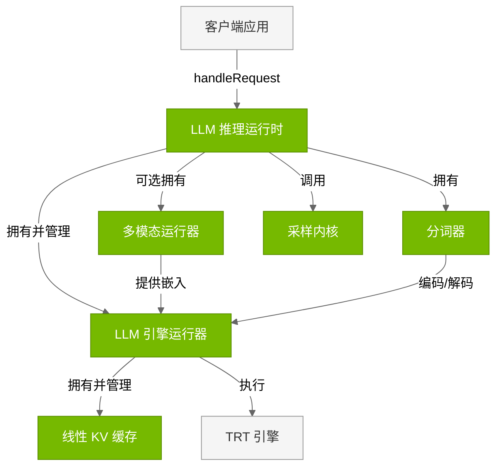

# LLM 推理运行时

## 架构


**LLM 推理运行时**在单一 `LLMEngineRunner` 上为标准自回归生成提供支持，覆盖纯文本与多模态（VLM）推理。





### 核心组件

| 组件 | 说明 |
|-----------|-------------|
| **LLM 引擎运行器** | 执行 TensorRT 引擎并管理双阶段推理。由 LLM 推理运行时持有（`mLLMEngineRunner`）。为 prefill 与生成阶段维护独立 TensorRT 执行上下文；自带 Linear KV 缓存实例；产生供运行时采样调用的 logits；支持 CUDA Graph 以降低延迟；支持动态切换 LoRA 适配器。*文件：* `cpp/runtime/llmEngineRunner.{h,cpp}` |
| **分词器** | 兼容 HuggingFace 的文本分词。使用 BPE 在文本与 token ID 间转换。LLM 推理运行时自有分词器实例。支持多种词表（GPT、Llama、Qwen）及可配特殊符号与预处理。*文件：* `cpp/tokenizer/tokenizer.{h,cpp}`、`preTokenizer.{h,cpp}`、`tokenEncoder.{h,cpp}` |
| **多模态运行器** | 多模态模型（VLM）的视觉处理。经 ViT 处理图像输入并生成视觉嵌入。支持 Qwen-VL、InternVL 等架构与动态图像词元。将视觉嵌入与文本 token 结合用于多模态推理。*文件：* `cpp/multimodal/multimodalRunner.{h,cpp}`、`qwenViTRunner.{h,cpp}`、`internViTRunner.{h,cpp}` |
| **线性 KV 缓存** | 注意力 KV 缓存管理。LLM 引擎运行器维护自有 Linear KV 缓存；跨推理步存储 K/V 以高效自回归；线性显存布局利于 GPU 访问，支持批处理与可变序列长度。*文件：* `cpp/runtime/linearKVCache.{h,cpp}` |
| **采样内核** | 由模型 logits 生成下一个 token。将 logits 转为概率分布并按策略采样（贪心、top-k、top-p、温度等）。由 LLM 推理运行时直接调用（非引擎运行器），在引擎产出 logits 之后；在 GPU 上批处理。*文件：* `cpp/sampler/sampling.{cu,h}` |
| **TRT 引擎** | TensorRT 推理引擎。由 ONNX 编译的优化引擎。LLM 推理运行时使用单一引擎，由 LLM 引擎运行器加载执行。通过内核融合、精度与显存等 TensorRT 优化获得高性能。*文件：* 由 `llm_build` 构建（见引擎构建器章节） |


## 推理工作流

LLM 推理运行时采用双阶段处理架构，面向自回归语言模型生成优化。

```mermaid
%%{init: {'theme':'neutral', 'themeVariables': {'primaryColor':'#76B900','primaryTextColor':'#fff','primaryBorderColor':'#5a8f00','lineColor':'#666','edgeLabelBackground':'#ffffff','labelTextColor':'#000','clusterBkg':'#ffffff','clusterBorder':'#999'}}}%%
graph LR
    INPUT_PROMPT(输入<br/>提示) --> TOKENIZER(分词)
    
    subgraph VIT_BOX ["可选"]
        VIT_PROCESS(ViT<br>处理)
    end
    
    TOKENIZER --> VIT_PROCESS
    VIT_PROCESS --> PREFILL_ENGINE(Prefill<br/>**TRT 引擎**)
    
    PREFILL_ENGINE --> GENERATE_KV[生成<br/>KV 缓存]
    GENERATE_KV --> SAMPLE_FIRST(采样首个<br/>词元)
    
    SAMPLE_FIRST --> GENERATION_ENGINE[生成阶段<br/>**TRT 引擎** 或<br/>**CUDA Graph**]
    
    GENERATION_ENGINE --> UPDATE_KV(更新<br>KV 缓存)
    UPDATE_KV --> SAMPLE_TOKEN(采样下一个<br/>词元)
    
    SAMPLE_TOKEN --> STOP_CHECK{停止<br/>条件?}
    STOP_CHECK -->|否| GENERATION_ENGINE
    STOP_CHECK -->|是| OUTPUT_SEQUENCE(生成<br/>序列)
    
    subgraph PHASE1 ["阶段 1：Prefill"]
        PREFILL_ENGINE
        GENERATE_KV
        SAMPLE_FIRST
    end
    
    subgraph PHASE2 ["阶段 2：生成"]
        GENERATION_ENGINE
        UPDATE_KV
        SAMPLE_TOKEN
        STOP_CHECK
        OUTPUT_SEQUENCE
    end
    
    classDef greyNode fill:#f5f5f5,stroke:#999,stroke-width:1px,color:#333
    classDef darkNode fill:#ffffff,stroke:#999,stroke-width:1px,color:#333
    classDef nvNode fill:#76B900,stroke:#5a8f00,stroke-width:1px,color:#fff
    classDef nvLightNode fill:#b8d67e,stroke:#76B900,stroke-width:1px,color:#333
    classDef inputNode fill:#f5f5f5,stroke:#999,stroke-width:1px,color:#333
    classDef itemNode fill:#ffffff,stroke:#999,stroke-width:1px,color:#333
    classDef lightSubGraph fill:none,stroke:#aaa,stroke-width:1.5px
    classDef optionalBox fill:none,stroke:#aaa,stroke-width:1px,stroke-dasharray:5 5
    
    class INPUT_PROMPT inputNode
    class TOKENIZER,SAMPLE_FIRST,SAMPLE_TOKEN,VIT_PROCESS,STOP_CHECK,PREFILL_ENGINE,GENERATION_ENGINE greyNode
    class GENERATE_KV,UPDATE_KV nvLightNode
    class OUTPUT_SEQUENCE darkNode
    class PHASE1,PHASE2 lightSubGraph
    class VIT_BOX optionalBox
```





### 推理阶段

**阶段 1：Prefill**

Prefill 阶段并行处理完整输入提示，建立初始推理状态：

- **输入处理**：文本分词并按批填充
- **多模态衔接**：VLM 下经 ViT 处理视觉嵌入并与文本嵌入融合
- **并行执行**：全部提示词元同时经 Transformer 层
- **KV 缓存生成**：为所有提示词元填充 KV 缓存
- **首个词元采样**：由输出 logits 采样第一个生成词元

**阶段 2：生成（自回归 Decode）**

生成阶段逐步自回归，每次处理一个已生成词元：

- **顺序处理**：每轮处理上一轮生成的词元
- **复用 KV 缓存**：利用此前步积累的 KV
- **CUDA Graph 优化**：可选捕获 CUDA Graph，降低内核启动开销约 10–30%
- **采样策略**：可配置贪心、top-k、top-p、温度等
- **停止条件**：直至 EOS、达到最大长度或自定义条件

---

## 使用示例

### 标准 LLM 推理

```cpp
#include "llmInferenceRuntime.h"

// Initialize runtime
LLMInferenceRuntime runtime(engineDir);

// Prepare request
InferenceRequest request;
request.inputText = "What is the capital of France?";
request.maxLength = 100;
request.temperature = 0.7;

// Execute inference
auto response = runtime.handleRequest(request);
std::cout << "Generated: " << response.outputText << std::endl;
```

### LoRA 适配器切换

```cpp
// Load LoRA adapters
runtime.addLoraWeights("medical", "lora_weights/medical_adapter.safetensors");
runtime.addLoraWeights("legal", "lora_weights/legal_adapter.safetensors");

// Use medical adapter
runtime.switchLoraWeights("medical");
auto medical_response = runtime.handleRequest(medical_request);

// Switch to legal adapter
runtime.switchLoraWeights("legal");
auto legal_response = runtime.handleRequest(legal_request);

// Disable LoRA
runtime.switchLoraWeights("");
auto base_response = runtime.handleRequest(base_request);
```

### 多模态 VLM 推理

```cpp
// Initialize multimodal runtime
LLMInferenceRuntime runtime(engineDir, visualEngineDir);

// Prepare multimodal request
InferenceRequest request;
request.inputText = "What's in this image?";
request.imagePaths = {"image.jpg"};
request.maxLength = 150;

auto response = runtime.handleRequest(request);
std::cout << "Generated: " << response.outputText << std::endl;
```

---

## 下一步

1. **推测解码**：参阅 [LLM 推理 SpecDecode 运行时](04.3_LLM_Inference_SpecDecode_Runtime.md) 了解 EAGLE
2. **高级特性**：参阅 [高级运行时特性](04.4_Advanced_Runtime_Features.md)（CUDA Graph、LoRA 等）
3. **运行示例**：见 [示例](05_Examples.md)
4. **集成应用**：在应用中使用运行时 API

---

## 更多资料

- **运行时 API**：见 `cpp/runtime/` 目录
- **示例应用**：见 `examples/llm/` 与 `examples/multimodal/`
- **架构概览**：见 [概览](01.1_Overview.md)

