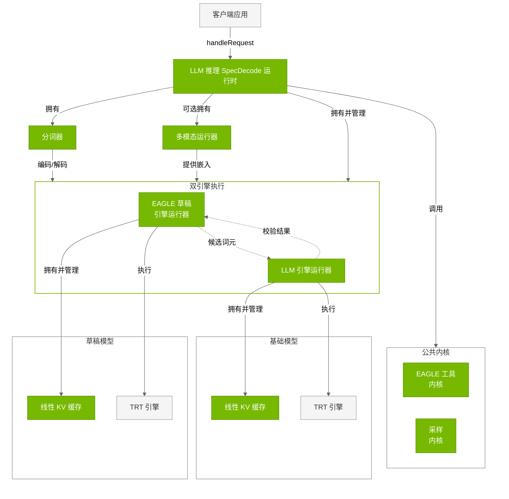

# LLM 推理 SpecDecode 运行时

## 架构

**LLM 推理 SpecDecode 运行时**使用**双引擎**（草稿与基础）实现 EAGLE 推测解码，加速词元生成。该运行时与 LLM 推理运行时完全独立，提供面向 EAGLE 树状推测生成的专用执行路径。




---


### 核心组件


| 组件 | 说明 |
|-----------|-------------|
| **LLM 引擎运行器（基础）** | 为基础模型执行 TensorRT 引擎并管理双阶段推理。由 LLM 推理 SpecDecode 运行时持有（`mBaseEngineRunner`）。为 prefill 与生成维护独立 TensorRT 上下文；自带 Linear KV 缓存；产生供运行时采样的 logits。**说明**：EAGLE SpecDecode 模式下不支持 CUDA Graph 优化；支持动态 LoRA。*文件：* `cpp/runtime/llmEngineRunner.{h,cpp}` |
| **EAGLE 草稿引擎运行器** | 面向 EAGLE 草稿模型的专用运行器，执行草稿推理以推测解码。由 SpecDecode 运行时持有（`mDraftEngineRunner`）。生成候选词元序列，由基础模型的 LLMEngineRunner 校验；维护独立 KV 缓存与执行上下文，适配草稿模型与树状词元生成。*文件：* `cpp/runtime/eagleDraftEngineRunner.{h,cpp}` |
| **分词器** | 兼容 HuggingFace 的 BPE 分词。SpecDecode 运行时自有分词器。*文件：* `cpp/tokenizer/tokenizer.{h,cpp}` 等 |
| **多模态运行器** | VLM 视觉处理，经 ViT 生成嵌入。*文件：* `cpp/multimodal/multimodalRunner.{h,cpp}` 等 |
| **线性 KV 缓存** | 各引擎运行器各自维护 Linear KV 缓存。*文件：* `cpp/runtime/linearKVCache.{h,cpp}` |
| **采样内核** | 由 logits 采样下一词元，由 SpecDecode 运行时直接调用。*文件：* `cpp/sampler/sampling.{cu,h}` |
| **EAGLE 工具内核** | EAGLE 推测解码专用 CUDA 内核：树构建、候选生成、校验与接受/拒绝逻辑。*文件：* `cpp/kernels/speculative/` |
| **TRT 引擎（双引擎）** | 基础与草稿两套 TensorRT 引擎，分别由对应运行器加载执行。*文件：* 由 `llm_build` 构建 |


## 推理工作流


**阶段 1：Prefill**

```mermaid
%%{init: {'theme':'neutral', 'themeVariables': {'primaryColor':'#76B900','primaryTextColor':'#fff','primaryBorderColor':'#5a8f00','lineColor':'#666','edgeLabelBackground':'#ffffff','labelTextColor':'#000','clusterBkg':'#ffffff','clusterBorder':'#999'}}}%%
graph LR
    INPUT_PROMPT(输入<br>提示)
    TOKENIZER(分词)
    
    subgraph VIT_BOX ["可选"]
        VIT_PROCESS(ViT<br>处理)
    end
    
    BASE_PREFILL_ENGINE[基础 Prefill<br/>**TRT 引擎**]
    BASE_KV_GEN(生成基础<br>KV 缓存、Logits<br>与隐状态)
    BASE_SAMPLE(采样)
    DRAFT_PREFILL_ENGINE[草稿 Prefill<br/>**TRT 引擎**]
    DRAFT_KV_GEN(生成草稿<br>KV 缓存、Logits<br>与隐状态)
    PHASE2_START(阶段 2：<br>生成)
    
    INPUT_PROMPT --> TOKENIZER
    TOKENIZER --> VIT_PROCESS
    VIT_PROCESS --> BASE_PREFILL_ENGINE
    BASE_PREFILL_ENGINE --> BASE_KV_GEN
    BASE_KV_GEN --> BASE_SAMPLE
    BASE_SAMPLE --> DRAFT_PREFILL_ENGINE
    DRAFT_PREFILL_ENGINE --> DRAFT_KV_GEN
    DRAFT_KV_GEN --> PHASE2_START
    
    classDef greyNode fill:#f5f5f5,stroke:#999,stroke-width:1px,color:#333
    classDef nvNode fill:#76B900,stroke:#5a8f00,stroke-width:1px,color:#fff
    classDef nvLightNode fill:#b8d67e,stroke:#76B900,stroke-width:1px,color:#333
    classDef inputNode fill:#f5f5f5,stroke:#999,stroke-width:1px,color:#333
    classDef optionalBox fill:none,stroke:#aaa,stroke-width:1px,stroke-dasharray:5 5
    
    class PHASE2_START nvNode
    class INPUT_PROMPT inputNode
    class TOKENIZER,VIT_PROCESS,BASE_PREFILL_ENGINE,DRAFT_PREFILL_ENGINE,BASE_SAMPLE greyNode
    class BASE_KV_GEN,DRAFT_KV_GEN nvLightNode
    class VIT_BOX optionalBox
```



**阶段 2：生成**

```mermaid
%%{init: {'theme':'neutral', 'themeVariables': {'primaryColor':'#76B900','primaryTextColor':'#fff','primaryBorderColor':'#5a8f00','lineColor':'#666','edgeLabelBackground':'#ffffff','labelTextColor':'#000','clusterBkg':'#ffffff','clusterBorder':'#999'}}}%%
graph LR
    PHASE1_INPUT(阶段 1：<br>Prefill)
    DRAFT_ACCEPT_ENGINE[草稿接受词元<br/>**TRT 引擎**]
    DRAFT_KV_GEN2(生成草稿<br>KV 缓存、Logits<br>与隐状态)
    
    subgraph TREE_CONSTRUCTION ["草稿树构建"]
        DRAFT_PROPOSAL_ENGINE[草稿批量提议<br/>**TRT 引擎**]
        SELECT_TOP_N(按 Logits<br>选 Top-N<br>词元)
        UPDATE_DRAFT_KV(更新草稿<br>KV 缓存与<br>隐状态)
        TREE_ROUND_CHECK{树轮次<br>结束?}
    end
    
    BASE_VERIFY_ENGINE[基础树校验<br/>**TRT 引擎**]
    EAGLE_ACCEPT(EAGLE 接受算法<br>词元选择)
    BUILD_KV_CACHE(用已接受词元<br>更新基础模型<br>KV 缓存)
    STOP_CHECK{停止?}
    OUTPUT_SEQUENCE(生成<br>序列)
    
    PHASE1_INPUT --> DRAFT_KV_GEN2
    DRAFT_ACCEPT_ENGINE --> DRAFT_KV_GEN2
    DRAFT_KV_GEN2 --> DRAFT_PROPOSAL_ENGINE
    DRAFT_PROPOSAL_ENGINE --> SELECT_TOP_N
    SELECT_TOP_N --> UPDATE_DRAFT_KV
    UPDATE_DRAFT_KV --> TREE_ROUND_CHECK
    TREE_ROUND_CHECK -->|否| DRAFT_PROPOSAL_ENGINE
    TREE_ROUND_CHECK -->|是| BASE_VERIFY_ENGINE
    BASE_VERIFY_ENGINE --> EAGLE_ACCEPT
    EAGLE_ACCEPT --> BUILD_KV_CACHE
    BUILD_KV_CACHE --> STOP_CHECK
    STOP_CHECK -->|否| DRAFT_ACCEPT_ENGINE
    STOP_CHECK -->|是| OUTPUT_SEQUENCE
    
    classDef greyNode fill:#f5f5f5,stroke:#999,stroke-width:1px,color:#333
    classDef darkNode fill:#ffffff,stroke:#999,stroke-width:1px,color:#333
    classDef nvNode fill:#76B900,stroke:#5a8f00,stroke-width:1px,color:#fff
    classDef nvLightNode fill:#b8d67e,stroke:#76B900,stroke-width:1px,color:#333
    classDef lightSubGraph fill:none,stroke:#aaa,stroke-width:1.5px
    
    class PHASE1_INPUT nvNode
    class TOKENIZER,TREE_ROUND_CHECK,STOP_CHECK,SELECT_TOP_N,DRAFT_ACCEPT_ENGINE,DRAFT_PROPOSAL_ENGINE,BASE_VERIFY_ENGINE greyNode
    class DRAFT_KV_GEN2,UPDATE_DRAFT_KV,BUILD_KV_CACHE nvLightNode
    class EAGLE_ACCEPT nvNode
    class OUTPUT_SEQUENCE darkNode
    class TREE_CONSTRUCTION lightSubGraph
```




### 推理阶段

**阶段 1：基础模型 Prefill**

EAGLE 从仅基础模型 prefill 开始：

- **基础模型 Prefill**：用 `LLMEngineRunner` 做标准 prefill，建立基础模型 KV 缓存
- **隐状态生成**：基础模型产生草稿模型所需的隐状态
- **单次 Prefill 顺序**：起初仅基础模型 prefill；草稿模型 prefill 在后续进行
- **多模态**：视觉嵌入只处理一次，供基础模型使用

**阶段 2：EAGLE 推测循环**

生成阶段采用迭代式树状推测，并条件性执行草稿 prefill：

- **首轮**：用 `EagleDraftEngineRunner` 与基础隐状态对草稿模型做 prefill
- **后续轮**：以草稿「接受词元」操作替代完整 prefill
- **草稿树构建**：草稿模型用 draft logits 的 top-k 采样生成候选词元树
- **基础模型校验**：基础模型并行处理整棵草稿树，为各树位置产生 logits
- **EAGLE 接受算法**：
  - 基础模型 **top-1 预测始终作为**最终词元来源
  - 草稿词元**仅在与基础预测一致时被接受**
  - 一旦与基础预测分叉，其余草稿词元**被拒绝**
  - 在词元一致时沿草稿树路径继续
- **词元来源**：最终输出词元均来自基础模型；草稿仅提供候选
- **无 CUDA Graph**：与 LLM 推理运行时不同，EAGLE 不支持 CUDA Graph
- **迭代**：直至满足停止条件或达到最大生成长度

---

## 与 LLM 推理运行时的主要差异

- **Prefill 顺序**：先完成基础模型 prefill；草稿 prefill 仅在首轮生成进行
- **无 CUDA Graph**：SpecDecode 运行时不开 CUDA Graph
- **树状推测**：草稿构建候选树，基础模型始终产生最终词元
- **接受/拒绝**：校验阶段由基础模型生成词元；仅当与基础一致时接受草稿词元
- **批大小**：仅支持批大小 1
- **状态复杂**：双模型各自维护 KV 与隐状态

---

## 使用示例

### EAGLE 推测解码

```cpp
#include "llmInferenceSpecDecodeRuntime.h"

// Initialize runtime with base and draft models
LLMInferenceSpecDecodeRuntime runtime(baseModelDir, draftModelDir);

// Execute inference
InferenceRequest request;
request.inputText = "Explain quantum computing.";
request.maxLength = 200;

auto response = runtime.handleRequest(request);
std::cout << "Generated: " << response.outputText << std::endl;
```

---

## 下一步

1. **高级特性**：参阅 [高级运行时特性](04.4_Advanced_Runtime_Features.md)（CUDA Graph、LoRA 等）
2. **运行示例**：见 [示例](05_Examples.md)
3. **性能对比**：在业务场景下对比 EAGLE 与标准运行时

---

## 更多资料

- **运行时 API**：见 `cpp/runtime/` 目录
- **EAGLE 说明**：见 `cpp/runtime/eagleDraftEngineRunner.h` 等
- **架构概览**：见 [概览](01.1_Overview.md)

