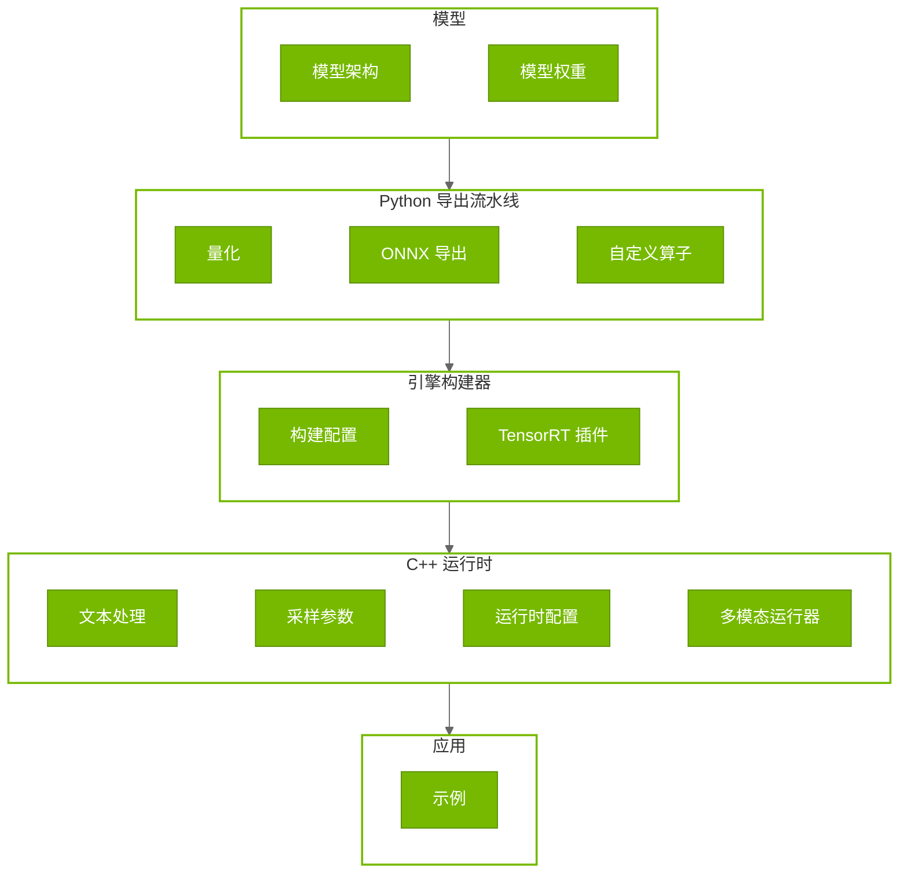

# 定制指南

## 定制架构

TensorRT Edge-LLM 从模型到推理的数据流清晰，各层均可定制：



### 各层定制点

| 层 | 组件 | 定制方式 |
|-------|-----------|----------------------|
| **模型** | 模型架构 | **配置：** 模型 config JSON。**继承/适配：** `EdgeLLMModel`、`EdgeLLMDecoderLayer`（`nn.Module`） |
| **模型** | 模型权重 | **替换：** 加载微调后的 HuggingFace 模型。**配置：** 指定模型目录 |
| **Python 导出** | 量化策略 | **配置：** FP16/FP8/INT4_AWQ/NVFP4/INT8_SQ、校准设置。**继承/适配：** `modelopt.torch.quantization` 类。**说明：** GPTQ 以预量化模型加载（非本流水线量化生成） |
| **Python 导出** | ONNX 导出逻辑 | **继承/适配：** `export_llm_model()`、`visual_export()`、`export_draft_model()`。**配置：** 动态轴、opset 版本 |
| **Python 导出** | 自定义算子 | **注册：** `@torch.library.custom_op()` 与 `register_custom_op_symbolic()` |
| **引擎构建器** | 构建配置 | **配置：** 批大小、序列长度、精度、LoRA 秩、EAGLE、VLM、图像词元等。**继承/适配：** 为自定义模型设置 optimization profile |
| **引擎构建器** | 自定义运算 | **插件：** 实现 TensorRT 的 `IPluginV2DynamicExt`、`IPluginCreator`。例：自定义注意力、专用内核 |
| **C++ 运行时** | 文本处理 | **配置：** 加载不同分词词表。**继承/适配：** `PreTokenizer`、`TokenEncoder` |
| **C++ 运行时** | 采样参数 | **配置：** 输入 JSON 中的 temperature、top-k、top-p。**继承/适配：** 扩展 `sampling.cu` |
| **C++ 运行时** | 多模态运行器 | **继承/适配：** `MultimodalRunner` 基类以支持新编码器 |
| **C++ 运行时** | 运行时行为 | **配置：** EAGLE 参数、预热 iterations、CUDA Graph、系统提示缓存、性能分析 |
| **应用** | 自定义应用 | 以示例为模板（见 [示例](05_Examples.md)） |

### 定制方式汇总

| 方式 | 说明 | 适用场景 |
|--------|-------------|----------|
| **继承/适配** | 扩展基类实现 | 模型架构、多模态运行器、PreTokenizer |
| **配置** | 通过配置文件与参数修改行为 | 模型配置、构建设置、运行时参数、LoRA |
| **整体替换** | 同接口替换整个组件 | 微调权重 |
| **注册** | 在现有体系中注册新组件 | ONNX 自定义算子、图模式 |
| **插件** | 为自定义运算实现 TensorRT 插件 | 自定义 TensorRT 层、硬件相关算子 |

---

## 第 1 层：模型

### 1. 模型架构定制

架构层提供封装 HuggingFace 模型并适配 TensorRT Edge-LLM 优化流水线的基类。

- [`EdgeLLMModel`](../../../tensorrt_edgellm/llm_models/models/llm_model.py)：核心模型类，封装 HuggingFace 模型并将解码层替换为优化实现。

- [`EdgeLLMDecoderLayer`](../../../tensorrt_edgellm/llm_models/layers/layers.py)：封装 HuggingFace 注意力与 MLP 的优化解码层。

- [`EdgeLLMAttention`](../../../tensorrt_edgellm/llm_models/layers/layers.py)：使用自定义注意力插件的多头注意力。

TensorRT Edge-LLM 自动检测并支持 Llama 系与 Qwen 系架构：

- **Llama 系**：`LlamaAttention`、`LlamaMLP`
- **Qwen 系**：`Qwen2Attention`、`Qwen2MLP`

其他架构可扩展 `EdgeLLMAttention` 包装你的注意力，并修改 `EdgeLLMDecoderLayer.__init__()` 以处理你的模型类型：

```python
if "your_model" in config.model_type:
    attention_module = YourModelAttention(config, index)
    self.mlp = YourModelMLP(config)
    self.self_attn = EdgeLLMAttention(attention_module, ...)
```

### 2. 模型权重定制

支持 **直接替换** 权重，任意 HuggingFace 微调模型均可使用。

**兼容微调方式：**

- 全量微调
- [LoRA](04.4_Advanced_Runtime_Features.md)（见文中「LoRA（低秩适配）支持」一节）
- 已合并的 PEFT 适配器
- GPTQ 预量化模型

---

## 第 2 层：Python 导出流水线

### 1. 量化策略定制

#### 量化配置

量化基于 [NVIDIA Model Optimizer](https://github.com/NVIDIA/Model-Optimizer)，提供多种策略。

**可用方法**（定义于 `tensorrt_edgellm/quantization/llm_quantization.py`）：

| 方法 | 配置 | 场景 | 平台 |
|--------|--------|----------|----------|
| **FP16** | N/A（默认） | 精度基线 | 全平台 |
| **FP8** | `mtq.FP8_DEFAULT_CFG` | 速度/精度平衡 | SM89+（Ada Lovelace+） |
| **INT4 AWQ** | `mtq.INT4_AWQ_CFG` | 最大压缩 | 全平台 |
| **INT8 SmoothQuant** | `mtq.INT8_SMOOTHQUANT_CFG` | 激活量化 | 全平台 |
| **NVFP4** | `mtq.NVFP4_DEFAULT_CFG` | NVIDIA 4-bit FP | SM100+（Blackwell+） |

**自定义量化配置：** 可修改配置字典，详见 [Quantization Formats](https://github.com/NVIDIA/Model-Optimizer/blob/main/modelopt/torch/quantization/config.py)。

```python
from tensorrt_edgellm.quantization.llm_quantization import get_llm_quant_config

quant_cfg = get_llm_quant_config("fp8", lm_head_quantization=None)

quant_cfg["quant_cfg"]["*embed_tokens*"] = {"enable": False}
quant_cfg["quant_cfg"]["*lm_head*"] = {"enable": False}

quant_cfg["algorithm"] = "max"
```

#### 校准数据

默认使用 `cnn_dailymail`，可换用自有数据集：

```python
import torch
from torch.utils.data import DataLoader, Dataset

class CustomCalibDataset(Dataset):
    def __init__(self, tokenizer, texts, max_length=512):
        self.tokenizer = tokenizer
        self.texts = texts
        self.max_length = max_length
    
    def __len__(self):
        return len(self.texts)
    
    def __getitem__(self, idx):
        encoded = self.tokenizer(
            self.texts[idx],
            max_length=self.max_length,
            padding="max_length",
            truncation=True,
            return_tensors="pt"
        )
        return encoded["input_ids"].squeeze(0)

domain_texts = load_domain_specific_corpus()
calib_dataset = CustomCalibDataset(tokenizer, domain_texts)
calib_dataloader = DataLoader(calib_dataset, batch_size=16, shuffle=False)
quantized_model = quantize_model(model, quant_cfg, calib_dataloader)
```

### 2. ONNX 导出逻辑定制

**主要导出函数**（`tensorrt_edgellm/onnx_export/llm_export.py`）：

- `export_llm_model()`：标准 LLM 或 EAGLE 基础模型
- `visual_export()`：VLM 视觉编码器
- `export_draft_model()`：EAGLE3 草稿模型

#### LLM 导出

[`export_llm_model()`](../../../tensorrt_edgellm/onnx_export/llm_export.py) 处理 LLM 与 EAGLE 基础模型。新架构可能需要：

- **输入**：修改 [`create_dummy_inputs()`](../../../tensorrt_edgellm/onnx_export/llm_export.py) 增加模型专用输入（如 Qwen3-VL 的 `deepstack_visual_embeds`）
- **动态轴**：更新 [`export_model_to_onnx()`](../../../tensorrt_edgellm/onnx_export/llm_export.py) 定义新输入/输出的动态维
- **输入输出名**：与 C++ 运行时约定一致

#### 多模态导出

[`visual_export()`](../../../tensorrt_edgellm/onnx_export/visual_export.py) 将 VLM 视觉编码器导出为 ONNX。支持模型见 [visual_models](../../../tensorrt_edgellm/visual_models)。

HuggingFace 视觉模型常含 ONNX 不兼容逻辑（flash attention、形状相关初始化、复杂后处理）。新增多模态编码器可用包装类：

- **外置形状相关计算**：预计算张量（如 `rotary_pos_emb`、`attention_mask`）作为显式输入
- **替换不支持的算子**：用标准 PyTorch 算子替代 flash attention
- **复杂前后置交给 C++**：如动态索引在运行时处理

参考现有 [visual_models](../../../tensorrt_edgellm/visual_models) 实现。

### 3. 自定义算子

自定义算子将 PyTorch 运算映射到 TensorRT 插件。内置示例：

- **Attention Plugin**（`tensorrt_edgellm/llm_models/layers/attention_plugin.py`）
- **INT4 GEMM Plugin**（`tensorrt_edgellm/llm_models/layers/int4_gemm_plugin.py`）
- **GatherND Plugin**（`tensorrt_edgellm/llm_models/layers/gather_nd.py`）

可参考现有示例注册自有算子。

```python
@torch.library.custom_op("trt::attention_plugin", mutates_args=())
def attention_plugin(
    qkv: torch.Tensor,
    past_key_value: torch.Tensor,
    context_lengths: torch.Tensor,
    rope_rotary_cos_sin: torch.Tensor,
    num_q_heads: int,
    num_kv_heads: int,
    # ... more parameters ...
) -> Tuple[torch.Tensor, torch.Tensor]:
    """Optimized attention with KV caching and RoPE."""
    pass

from tensorrt_edgellm.llm_models.layers.attention_plugin import \
    register_attention_plugin_onnx_symbolic_functions

register_attention_plugin_onnx_symbolic_functions()
```

---

## 第 3 层：引擎构建器

### 1. LLM 构建器定制

[`LLMBuilder`](../../../cpp/builder/builder.h) 从 ONNX 构建 TensorRT 引擎。CLI [`llm_build`](../../../examples/llm/llm_build.cpp) 提供命令行接口。

构建器自动创建 **两个 optimization profile**：

| Profile | 阶段 | 输入形状 | 用途 |
|---------|-------|-------------|---------|
| 0 | Context（Prefill） | `[batch, 1..maxInputLen]` | 变长初始提示 |
| 1 | Generation（Decode） | `[batch, 1]` | 自回归生成 |

新架构需扩展 [`builder.cpp`](../../../cpp/builder/builder.cpp) 中的 profile 设置：

- `setupCommonProfiles()`：上下文长度、RoPE、KV 缓存（共享）
- `setupVanillaProfiles()`：标准 LLM 的 input_ids、last_token_ids
- `setupEagleProfiles()`：EAGLE 隐状态、注意力掩码、位置 ID
- `setupVLMProfiles()`：VLM 图像嵌入
- `setupLoraProfiles()`：动态秩的 LoRA 权重矩阵

### 2. 多模态构建器定制

[`VisualBuilder`](../../../cpp/builder/builder.h) 构建视觉编码器引擎。CLI [`visual_build`](../../../examples/multimodal/visual_build.cpp)。

新视觉编码器可选：

1. **扩展 VisualBuilder**：在 [`builder.cpp`](../../../cpp/builder/builder.cpp) 中新增 profile 方法（如 `setupYourViTProfile()`），由 `minImageTokens`/`maxImageTokens` 计算输入形状。

2. **使用 trtexec**：简单模型可直接用 TensorRT 命令行构建。

---

## 第 4 层：C++ 运行时

### 1. 文本处理与分词

[`Tokenizer`](../../../cpp/tokenizer/tokenizer.h) 提供兼容 HuggingFace 的编解码。

- **`PreTokenizer`**（[`preTokenizer.h`](../../../cpp/tokenizer/preTokenizer.h)）：编码前基于正则的切分
- **`TokenEncoder`**（[`tokenEncoder.h`](../../../cpp/tokenizer/tokenEncoder.h)）：BPE 与词表管理

从引擎目录自动加载（`tokenizer.json`、`tokenizer_config.json`）。新分词方案可扩展 `TokenEncoder`（如 SentencePiece、WordPiece）。

### 2. 采样参数

[`SamplingParams`](../../../cpp/sampler/sampling.h) 控制随机性：

| 参数 | 范围 | 效果 |
|-----------|-------|--------|
| `temperature` | 0.0 - 2.0 | **0.0**：确定性（贪心）。**1.0**：常规采样。**>1.0**：更随机 |
| `top_k` | 0 - vocab_size | **0**：关闭。**1**：贪心。**50**：从前 50 个采样 |
| `top_p` | 0.0 - 1.0 | **1.0**：关闭。**0.9**：核采样（90% 概率质量） |

更多参数（如 `repetition_penalty`、`logits_bias`）或自定义算法（如束搜索）可扩展 [`sampling.cu`](../../../cpp/sampler/sampling.cu)。

### 3. 多模态运行器

[`MultimodalRunner`](../../../cpp/multimodal/multimodalRunner.h) 为 VLM 视觉编码提供接口。`MultimodalRunner::create()` 按模型类型实例化。

**现有运行器：**

- [`QwenViTRunner`](../../../cpp/multimodal/qwenViTRunner.h)：Qwen2-VL、Qwen2.5-VL、Qwen3-VL
- [`InternViTRunner`](../../../cpp/multimodal/internViTRunner.h)：InternVL3
- [`Phi4MMViTRunner`](../../../cpp/multimodal/phi4mmViTRunner.h)：Phi-4-multimodal

**新增 VLM**：继承 `MultimodalRunner` 并实现：

1. `validateAndFillConfig()`：解析配置与维度
2. `allocateBuffer()`：分配张量并绑定引擎
3. `preprocess()`：加载图像、预处理、RoPE 等
4. `infer()`：执行视觉编码器引擎

并在 `MultimodalRunner::create()` 中注册。

### 4. 运行时特性

[`LLMInferenceRuntime`](../../../cpp/runtime/llmInferenceRuntime.h) 提供高层 API 与多项优化：

- **CUDA Graph 捕获**：`captureDecodingCUDAGraph()` 降低内核启动开销
- **系统提示缓存**：`genAndSaveSystemPromptKVCache()` 缓存常用系统提示的 KV，降低首词元延迟
- **LoRA 切换**：运行时切换适配器，无需重编引擎
- **EAGLE3 推测解码**：[`llmInferenceSpecDecodeRuntime`](../../../cpp/runtime/llmInferenceSpecDecodeRuntime.h) 草稿提议与树校验

扩展能力可改 [`LLMEngineRunner`](../../../cpp/runtime/llmEngineRunner.h)（核心执行）或 [`LLMInferenceRuntime`](../../../cpp/runtime/llmInferenceRuntime.cpp)（请求处理）。

---

## 第 5 层：应用

[`llm_inference`](../../../examples/llm/llm_inference.cpp) 示例可作为自定义应用参考。

### 构建自定义应用

- **自定义输入输出**：解析自有格式并转为 `LLMGenerationRequest`
- **多媒体输入**：示例从文件读图；可改为视频帧、网络流、内存缓冲、摄像头等

```cpp
// my_custom_app.cpp
#include "runtime/llmInferenceRuntime.h"
#include "tokenizer/tokenizer.h"
#include "common/trtUtils.h"

int main(int argc, char** argv) {
    // 1. Parse command line arguments
    // ... argument parsing ...
    
    // 2. Initialize CUDA
    cudaStream_t stream;
    CUDA_CHECK(cudaStreamCreate(&stream));
    
    // 3. Load plugin library
    auto pluginHandles = trt_edgellm::loadEdgellmPluginLib();
    
    // 4. Create runtime
    auto runtime = trt_edgellm::rt::LLMInferenceRuntime::create(
        engineDir,
        multimodalEngineDir,  // Empty string for text-only
        loraWeightsMap,
        stream
    );
    
    // 5. Optional: Warmup and CUDA graph capture
    if (warmupIterations > 0) {
        // Run warmup requests
        runtime->captureDecodingCUDAGraph(stream);
    }
    
    // 6. Process requests
    for (auto const& input : inputs) {
        trt_edgellm::rt::LLMGenerationRequest request;
        trt_edgellm::rt::LLMGenerationResponse response;
        
        // Fill request from input
        request.userPrompt = input.prompt;
        request.systemPrompt = input.systemPrompt;
        request.temperature = input.temperature;
        request.topK = input.topK;
        request.topP = input.topP;
        request.maxGenerateLength = input.maxLength;
        
        // Handle request
        if (!runtime->handleRequest(request, response, stream)) {
            LOG_ERROR("Failed to handle request");
            continue;
        }
        
        // Process response
        std::cout << "Generated: " << response.generatedText << std::endl;
    }
    
    // 7. Cleanup
    CUDA_CHECK(cudaStreamDestroy(stream));
    return 0;
}
```

### 最佳实践

**1. 错误处理：** 检查 API 返回值；易异常处使用 try-catch；带上下文记录日志。

**2. 资源管理：** 每线程或每请求创建 CUDA 流；正确销毁流与释放显存；RAII 管理生命周期。

**3. 性能：** 基准前预热；预热后捕获 CUDA Graph；适用时缓存系统提示；按硬件选择批大小。

**4. 测试：** 多种输入长度；与基线对比质量；性能分析找瓶颈；边界情况（空输入、超长序列）。

**5. 部署：** 打包引擎、分词器、插件；设置环境变量（`EDGELLM_PLUGIN_PATH`）；文档化依赖与系统要求；提供示例输入与期望输出。
