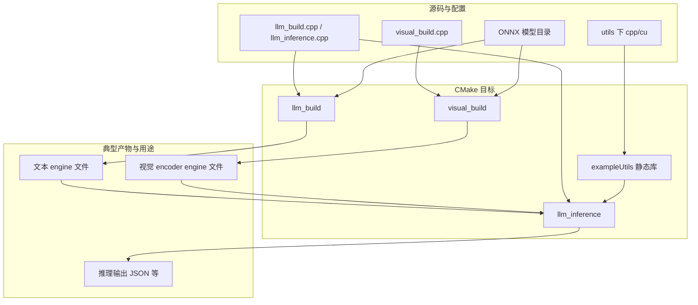

# 示例目录总览

本目录提供 TensorRT Edge-LLM 在边缘设备上的**可编译示例**：文本 LLM 的 engine 构建与推理、视觉编码器（VLM 视觉分支）的 engine 构建，以及供可执行文件复用的工具静态库。另含 **Python 精度评测流水线**（`accuracy/`，不参与顶层 CMake 聚合）。

与上游官方说明的对照请参阅开发者指南中的「示例」章节；本文件侧重**本仓库 CMake 拓扑**与各子目录职责。

---

## CMake 构建拓扑

根文件 [`CMakeLists.txt`](CMakeLists.txt) 仅通过 `add_subdirectory` 引入三个子工程：

| 子目录 | 作用 |
|--------|------|
| `utils/` | 编译为静态库 `exampleUtils`，供 `llm_inference` 等链接 |
| `llm/` | 生成可执行文件 `llm_build`、`llm_inference` |
| `multimodal/` | 生成可执行文件 `visual_build` |

**说明：** `accuracy/` 下无 `CMakeLists.txt`，不由此处 CMake 编译；需单独配置 Python 环境运行脚本。

---

## 子目录文档索引

| 路径 | 说明 |
|------|------|
| [utils/README.md](utils/README.md) | 示例公用工具库（显存监控、性能输出格式化等） |
| [llm/README.md](llm/README.md) | 文本侧 ONNX 解析、engine 构建与端到端推理示例 |
| [multimodal/README.md](multimodal/README.md) | 视觉编码器 ONNX 解析与 engine 构建示例 |
| [accuracy/README.md](accuracy/README.md) | 精度与 ROUGE 评测脚本及数据集格式（中文）；英文原文见 [accuracy/README_en.md](accuracy/README_en.md) |

---

## 依赖关系（概念层）

示例可执行文件与库依赖主工程已导出的目标（如 `edgellmCore`、`edgellmBuilder`、`commonLibraryExt` 等），并链接 ONNX Parser 等；具体 `target_link_libraries` 以各子目录 `CMakeLists.txt` 为准。完整安装与交叉编译选项见仓库根目录文档中的安装与快速入门。

---

## 数据流与构建关系（总览）

下图从「源码与配置」到「可执行产物」概括本目录内 CMake 能直接产生的目标及其典型用途（不含 `accuracy` 的 Python 流程）。

---

## 子流程：与 accuracy 评测衔接

精度评测在**已构建 engine 文件**与 **Edge LLM 格式 JSON 数据集**就绪后，通过 `llm_inference` 批量生成预测，再由 Python 脚本打分。详见 [accuracy/README.md](accuracy/README.md)。

