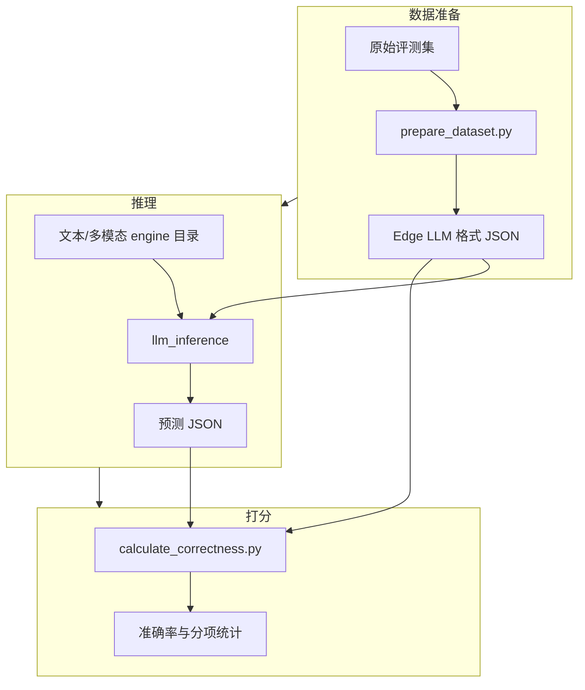
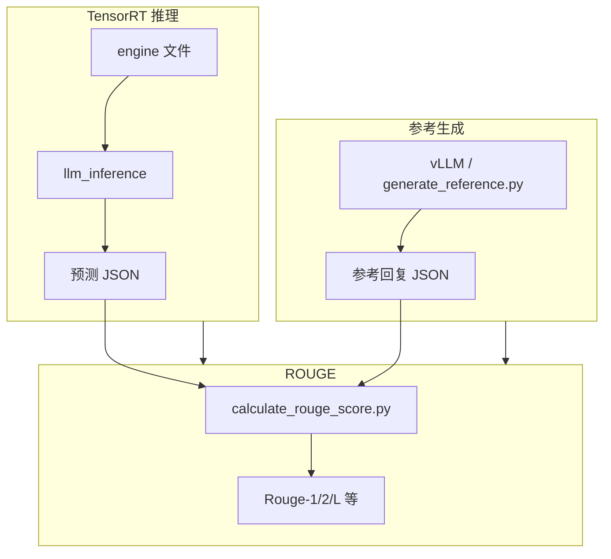
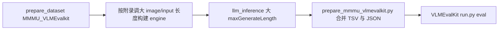

# 精度与相似度评测（Python）

本目录提供在 TensorRT Edge-LLM **engine 文件**之上运行**准确率评测**与 **ROUGE 相似度评测**的工具链。与 `examples/llm`、`examples/multimodal` 不同，此处**没有** `CMakeLists.txt`，全部为 **Python 脚本**与数据集定义；请先按主工程文档完成 C++ 示例与 engine 构建。

**英文原文说明**（命令与附录更全）见同目录 [README_en.md](README_en.md)。

---

## 模块定位

| 类型 | 说明 |
|------|------|
| 准确率评测 | 将模型预测与标准答案对比，支持 MMLU、MMLU_Pro、MMMU、MMMU_Pro 等（经 `prepare_dataset.py` 转为 Edge LLM JSON 格式）。 |
| ROUGE 评测 | 以 vLLM 等生成参考回复，再与 TensorRT Edge-LLM 生成结果比对 ROUGE 指标。 |

---

## 环境与依赖

```bash
pip install -r requirements.txt
```

若运行 ROUGE 流程中的参考生成，另需安装 vLLM（体积与 CUDA 依赖较大，按需安装）：

```bash
pip install vllm
```

评测脚本假设已在**工程根目录**构建出 `llm_build`、`llm_inference`、`visual_build` 等可执行文件；具体路径以 [README_en.md](README_en.md) 中的 `./build/examples/...` 为准。

---

## 构建 engine 文件（与评测衔接）

准确率数据集上下文较长，建议在构建文本 engine 时使用较大序列长度（如 8192–10240）。纯文本与多模态、以及 VLMEvalKit 对齐场景下的命令示例见 [README_en.md](README_en.md)；此处强调角色划分：

- **文本 engine**：`llm_build`
- **视觉 encoder engine**（多模态）：`visual_build`
- **VLM 文本分支**：`llm_build` 需加 `--vlm` 及与视觉侧一致的 image token 范围参数

---

## 主流程：准确率评测



典型命令顺序（占位路径请替换为实际目录）：

1. `python3 scripts/prepare_dataset.py --dataset MMLU --output_dir ...`
2. 在工程根目录执行 `./build/examples/llm/llm_inference`，指定 `--engineDir`、`--inputFile`、`--outputFile`；多模态另加 `--multimodalEngineDir` 等。
3. `python3 scripts/calculate_correctness.py --predictions_file ... --answers_file ...`

---

## 子流程：ROUGE 相似度评测



---

## 子流程：与 VLMEvalKit 对齐的 MMMU（可选）

若需与 HuggingFace 生态中常见的 VLMEvalKit 评测协议对齐，需更长上下文与特定采样参数、以及将预测合并为 VLMEvalKit 所需 xlsx 等步骤。完整分步命令与 engine 超参建议见 [README_en.md](README_en.md) 附录；数据准备可使用 `prepare_dataset.py --dataset MMMU_VLMEvalkit` 与 `prepare_mmmu_vlmevalkit.py`。



---

## 目录与脚本索引

| 路径 | 作用 |
|------|------|
| `scripts/prepare_dataset.py` | 将各数据集转为 Edge LLM JSON |
| `scripts/calculate_correctness.py` | 准确率计算 |
| `scripts/generate_reference.py` | vLLM 生成参考 |
| `scripts/calculate_rouge_score.py` | ROUGE 打分 |
| `scripts/prepare_mmmu_vlmevalkit.py` | VLMEvalKit 用 MMMU 输出整理 |
| `example_datasets/*.py` | 各数据集加载与格式定义 |
| `requirements.txt` | Python 依赖列表 |

---

## 注意事项摘要

- 推理二进制建议在**工程根目录**下调用，以便相对路径与文档一致。
- 多模态需同时构建视觉与文本 engine，推理时传入 `--multimodalEngineDir` 等参数。
- 所有送入 `llm_inference` 的批量输入须为 **Edge LLM JSON 格式**。
