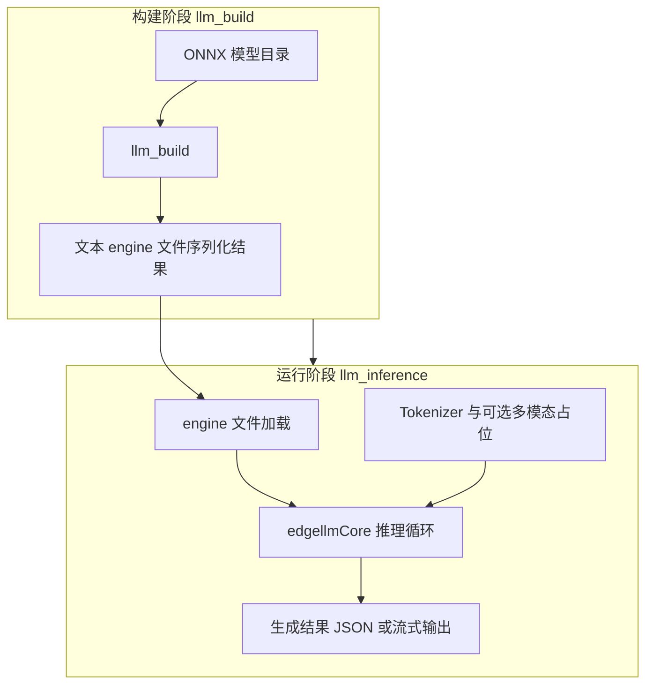
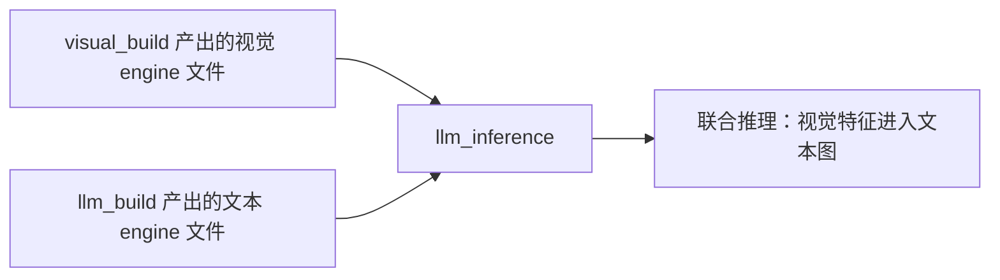

# LLM 示例：engine 构建与推理

本目录提供两个可执行目标：**`llm_build`**（从 ONNX 构建文本侧 TensorRT **engine 文件**）与 **`llm_inference`**（加载 engine、执行 token 化与自回归生成等端到端推理）。二者对应边缘侧部署流程中「编译期构建」与「运行期服务」两个阶段。

---

## 模块定位

| 可执行文件 | 职责概要 |
|------------|----------|
| `llm_build` | 解析 ONNX，调用 Edge LLM 构建器生成序列化 engine；支持纯文本与 VLM 文本分支相关参数（如 `--vlm` 与 image token 范围）。 |
| `llm_inference` | 反序列化 engine、管理 KV cache / 激活缓存等资源，按输入 JSON 或交互模式驱动生成；多模态场景下可额外指定视觉 encoder 的 engine 目录。 |

---

## CMake 配置说明

[`CMakeLists.txt`](CMakeLists.txt) 定义两个可执行目标：

1. **`llm_build`**
   - 源文件：`llm_build.cpp`
   - `target_link_libraries`：`${NV_ONNX_PARSER_LIB}`、`commonLibraryExt`、`edgellmBuilder`
   - `target_include_directories`：`${ONNX_PARSER_INCLUDE_DIR}`、`${COMMON_INCLUDE_DIRS}`
   - `add_cross_build_link_options(llm_build)`：应用工程统一的交叉编译链接选项

2. **`llm_inference`**
   - 源文件：`llm_inference.cpp`
   - `target_link_libraries`：`edgellmCore`、`edgellmTokenizer`、`exampleUtils`、`commonLibraryExt`
   - `target_include_directories`：`${COMMON_INCLUDE_DIRS}` 以及 `${CMAKE_SOURCE_DIR}/examples/utils`（使用 `exampleUtils` 头文件）
   - 同样调用 `add_cross_build_link_options(llm_inference)`

**与上级目录关系：** [`../CMakeLists.txt`](../CMakeLists.txt) 通过 `add_subdirectory(llm)` 将本目录纳入示例构建。

---

## 依赖关系

| 组件 | 用途 |
|------|------|
| `edgellmBuilder` | `llm_build` 内构建 TensorRT plan / 序列化 engine |
| `NV_ONNX_PARSER_LIB` | 解析 ONNX 图结构 |
| `edgellmCore` | 运行时加载 engine、执行推理与内存管理 |
| `edgellmTokenizer` | 文本与多模态模板相关的分词与编码 |
| `exampleUtils` | 显存与性能信息辅助（见 [utils/README.md](../utils/README.md)） |

输入输出格式等细节可参考同目录 [`INPUT_FORMAT.md`](INPUT_FORMAT.md)（保持英文原文，不在此翻译）。

---

## 端到端数据流（主流程）

从 ONNX 到线上推理输出的概念链路如下（省略具体 CLI 参数名，仅表达数据形态）。

---

## 子流程：VLM 文本分支与视觉 engine 协同

多模态评测或应用需在构建文本 engine 时传入与视觉侧一致的 image token 配置，并在推理时通过单独参数加载视觉 encoder 的 engine。视觉 encoder 本身由 [`../multimodal/visual_build`](../multimodal/README.md) 构建。

---

## 延伸阅读

- 仓库根目录 [开发者指南](../../docs_zh/source/developer_guide/05_Examples.md) 中的示例说明（若路径随版本调整，以当前仓库 `docs_zh` 为准）。
- 精度评测与 `llm_inference` 的批量调用方式见 [accuracy/README.md](../accuracy/README.md)。
