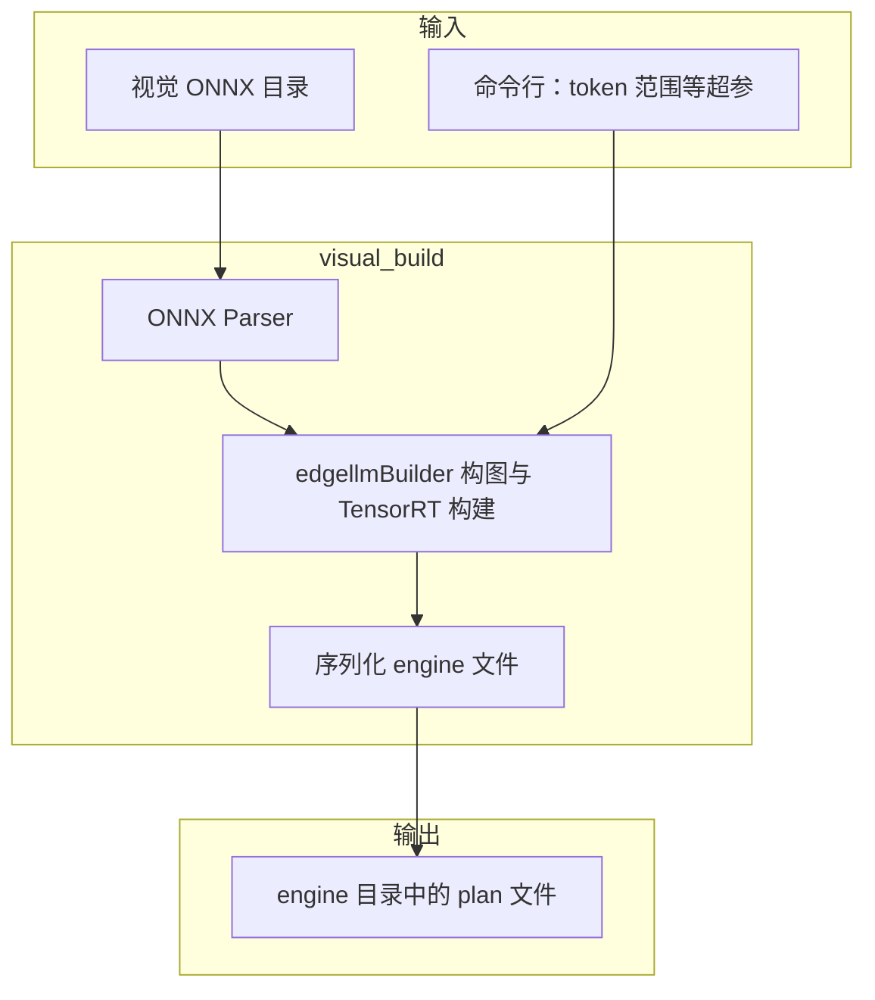
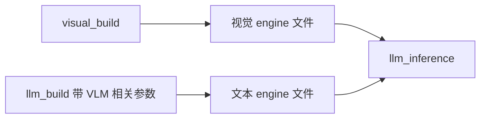

# 多模态示例：视觉编码器 engine 构建（visual_build）

本目录提供可执行文件 **`visual_build`**：从**视觉编码器** ONNX 构建 TensorRT **engine 文件**，供 VLM（视觉语言模型）流水线中与文本侧 `llm_build` / `llm_inference` 配合使用。本程序不负责完整多模态对话逻辑，聚焦于**图像分支**的 TensorRT 引擎产物。

---

## 模块定位

- **输入**：视觉 ONNX 模型目录（与工程导出流水线一致的路径布局）。
- **输出**：序列化后的视觉 encoder **engine 文件**，在运行期由 `llm_inference` 通过 `--multimodalEngineDir`（或当前版本等价参数）加载。
- **关键配置**：与图像 token 数量相关的下限/上限（如 `minImageTokens` / `maxImageTokens`）影响显存占用与可处理分辨率，需与文本 engine 构建参数对齐。

---

## CMake 配置说明

[`CMakeLists.txt`](CMakeLists.txt) 内容要点：

1. **`add_executable(visual_build visual_build.cpp)`**：单源文件可执行目标。
2. **`target_link_libraries(visual_build PRIVATE ${NV_ONNX_PARSER_LIB} commonLibraryExt edgellmBuilder)`**：ONNX 解析、公共库与 Edge LLM 构建器，用于将视觉 ONNX 编译为 TensorRT engine。
3. **`target_include_directories(visual_build PRIVATE ${ONNX_PARSER_INCLUDE_DIR} ${COMMON_INCLUDE_DIRS})`**。
4. **`add_cross_build_link_options(visual_build)`**：与 `llm_build` 一致的交叉链接选项。

上级 [`../CMakeLists.txt`](../CMakeLists.txt) 通过 `add_subdirectory(multimodal)` 纳入构建。

---

## 依赖关系

| 依赖 | 说明 |
|------|------|
| `edgellmBuilder` | 视觉分支网络构建与 engine 序列化 |
| `NV_ONNX_PARSER_LIB` | 读取视觉 ONNX |
| `commonLibraryExt` | 工程公共能力 |

运行期加载由 **`llm_inference` + `edgellmCore`** 完成，本目录仅产出 engine 文件。

---

## 数据流（主流程）

从 ONNX 到可用于 VLM 推理的 engine 文件的链路如下。

---

## 子流程：与文本 engine 及推理衔接

视觉 engine 与文本 engine 需在**图像 token 语义与规模**上一致，否则运行期可能因 shape 或插件约定不匹配而失败。

更完整的评测脚本与命令示例见 [accuracy/README.md](../accuracy/README.md) 与 [accuracy/README_en.md](../accuracy/README_en.md)。
