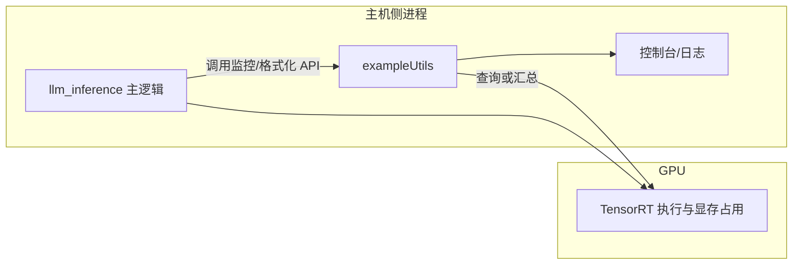

# 示例工具库（exampleUtils）

本目录实现示例程序共用的**非核心推理逻辑**：设备显存占用观测、TensorRT 性能分析结果的格式化输出等。CMake 将其编译为静态库 **`exampleUtils`**，供例如 `llm_inference` 链接，避免在单个 `.cpp` 内重复实现监控与打印逻辑。

---

## 模块定位

- **不包含** TensorRT network 构建或 engine 反序列化的主体逻辑；这些在 `edgellmCore` / `edgellmBuilder` 与 `llm_*`、`visual_build` 中。
- **包含** 与「运行时可观测性」相关的辅助代码：便于在 Jetson 等平台上对比配置变更前后的显存与耗时表现。

---

## CMake 配置说明

[`CMakeLists.txt`](CMakeLists.txt) 要点如下：

1. **`file(GLOB_RECURSE ... "*.cpp" "*.cu")`**：收集本目录下全部 C++ 与 CUDA 翻译单元，统一编入同一静态库。
2. **`add_library(exampleUtils STATIC ...)`**：生成静态库目标 `exampleUtils`。
3. **`target_include_directories(... PUBLIC ${CMAKE_CURRENT_SOURCE_DIR} ${COMMON_INCLUDE_DIRS})`**：对外暴露本目录头文件路径及工程公共头文件路径，使链接方可直接 `#include` 本目录头文件。
4. **`target_link_libraries(exampleUtils PRIVATE edgellmCore commonLibraryExt)`**：私有链接核心运行时与公共扩展库，使库内实现可调用工程内统一封装的 CUDA / 日志等能力（以实际源码为准）。

`llm_inference` 在 [`../llm/CMakeLists.txt`](../llm/CMakeLists.txt) 中通过 `target_link_libraries(... exampleUtils ...)` 并额外 `target_include_directories(... ${CMAKE_SOURCE_DIR}/examples/utils)` 使用该库。

---

## 依赖关系

| 依赖 | 说明 |
|------|------|
| `edgellmCore` | 与 Edge LLM 运行时一致的核心依赖，供工具函数访问统一抽象 |
| `commonLibraryExt` | 工程内公共扩展库 |
| 头文件目录 | `COMMON_INCLUDE_DIRS` 及本目录 |

---

## 数据流说明（监控与输出）

工具库在**推理进程侧**工作：在关键阶段前后查询设备显存或解析 TensorRT profiler 数据，将结果**格式化输出到标准输出或日志**，不参与模型张量在 GPU 上的数学运算。

---

## 相关文件

实现与声明以目录内 `.cpp` / `.h` 为准，常见包括显存监控与 profile 格式化相关源文件。详细调用点见 [`../llm/llm_inference.cpp`](../llm/llm_inference.cpp) 中的包含关系与函数调用。
